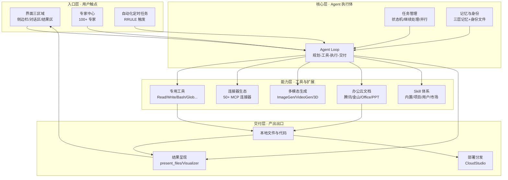

# WorkBuddy 功能清单及功能解读

> 系列解读 01/04 · 定位：**横向全景 —— WorkBuddy 能做什么**
>
> 本文基于 WorkBuddy 官方文档（Overview / Quickstart / Create-Task / Task-Management）与客户端系统机制一手信息整理，面向技术读者，力求回答三个问题：**功能全景是什么、每类功能解决什么问题、功能之间如何咬合成一个整体**。

---

## 1. 引言：从"对话助手"到"任务执行体"

WorkBuddy 是腾讯出品的**全场景 AI 办公智能体桌面工作台**。它的对外口号是"说出要求、开始执行任务、交付完整成果"，并强调"完美连接腾讯办公生态"。

与传统 AI 对话产品相比，本质区别在于**职责边界**：

| 维度 | 传统 AI 对话 | WorkBuddy |
|---|---|---|
| 产出 | 建议、文案、代码片段 | **可验收的完整成果**（文件、站点、报告、原型） |
| 动作 | 停留在文本层面 | **实际执行**：读写本地文件、跑命令、调外部服务 |
| 任务形态 | 单轮问答 | 多步骤复杂任务：拆解 → 规划 → 执行 → 交付 |
| 连续性 | 会话上下文 | 任务列表持久化、可继续处理、可多任务并行 |

一句话概括：传统 AI 告诉你"怎么做"，WorkBuddy 直接**把事做完**。

---

## 2. 功能总览：一张清单看全景

| 类别 | 功能点 | 一句话说明 |
|---|---|---|
| 核心对话与任务执行 | 自然语言下达任务 | 一句话描述需求，无需操作步骤 |
| | 自主规划执行 | 自动拆解任务、规划步骤、执行操作并交付成果 |
| | 多任务并行 | 同时发起、管理多个独立任务 |
| | 三种工作模式 | Craft（直接执行）/ Plan（先出方案后执行）/ Ask（只读问答） |
| 界面三区域 | 侧边栏 / 对话区 / 结果区 | 任务导航、人机对话、成果查看三区分离 |
| 文件与代码能力 | 本地文件操作 | 读写授权目录，批量整理/重命名/格式转换 |
| | 代码开发 | 生成、审查、修 Bug、重构、理解陌生代码库、全流程建站 |
| 多模态生成 | ImageGen / VideoGen / 3D | 文生图/图生图、文生视频/图生视频、3D 模型生成（消耗积分） |
| 办公云文档 | 腾讯文档 / 金山 / Office/WPS / PPT | 在线文档创建编辑、本地 Office 文件读写、PPT 生成、文档转 Markdown |
| 连接器生态（MCP） | 50+ 官方连接器 + 自定义 MCP | GitHub、腾讯文档、飞书、钉钉、金融数据、法务等第三方能力接入 |
| 专家中心 | 100+ 领域专家 | 按分类浏览专家并发起专业领域对话 |
| 自动化定时任务 | 定时/周期自动化 | 按 RRULE 或单次时间点自动触发任务，支持有效期 |
| 任务管理 | 状态机 + 任务操作 | 进行中/完成/失败/待处理等状态，置顶、分享、归档、继续处理 |
| 记忆与身份 | 三层记忆 + 身份文件 | 云记忆、用户级记忆、Workspace 记忆，配合 SOUL/IDENTITY/USER |
| 部署分发 | CloudStudio 静态部署 | 本地目录 → 云沙箱 → 访问 URL，一站式发布 |
| 结果呈现 | present_files + Visualizer | 产物卡片、HTML 实时预览、内联 SVG/HTML 图表 |
| 环境要求 | 网络 + 账号 | 依赖 AI 模型服务，需登录 WorkBuddy 账号 |

---

## 3. 逐类深度解读

### 3.1 核心对话与任务执行

**解决什么问题**：把"人用自然语言描述意图"到"机器产出完整成果"之间的鸿沟填平。传统工作流里人需要把需求翻译成一步步操作，WorkBuddy 把这个翻译过程交给了 Agent 本身。

**典型使用场景**：
- 一句话下达任务："整理桌面所有 PDF 并重命名为《项目名-日期》格式"
- 多步骤复杂任务："调研三款数据库的对比，输出一份带图表的分析报告"
- 多任务并行：同时推进文档撰写、代码修改、数据分析三个任务

**关键细节**：
- **任务执行过程在对话区实时可见**，不是黑盒——用户可以观察每一步的规划与工具调用。
- **三种工作模式**是执行策略的分层：`Craft` 最直接（You say, I do）；`Plan` 先分析设计、用户确认后再执行（适合高成本/高风险任务）；`Ask` 只读问答，不动文件、不执行命令（适合咨询、代码审查前的问题澄清）。
- **继续处理**机制：已完成、失败或中断的任务可以重新进入对话，基于原上下文补充消息继续推进，避免"推倒重来"。

### 3.2 界面三区域

**解决什么问题**：任务驱动的产品需要"导航 — 对话 — 成果"三件事互不遮挡。传统 AI 界面只有聊天窗，任务多了之后上下文混乱、成果难找。

**典型使用场景**：同时进行 5 个任务时，左侧按文件夹分组快速定位；对话区里 @ 引用文件补充上下文；完成后在右侧结果区直接验收产物。

**关键细节**：
- **侧边栏**：任务列表按文件夹分组，分「任务/空间」两板块；支持按状态、日期搜索筛选；顶部是用户头像。
- **对话区**：任务标题栏 + 消息列表 + 输入框。输入框集成了工作空间选择、`@` 引用文件/文档/规则、`Ctrl+V` 粘贴截图、上传/拖拽文件——上下文补充能力全部集中在输入入口。
- **结果区**：产物、全部文件、变更、预览等视图，是验收任务的"工作台"。

### 3.3 文件与代码能力

**解决什么问题**：AI 办公最大的痛点是"只能说话、碰不到文件"。WorkBuddy 通过授权目录把 Agent 的"手"伸进本地文件系统，代码能力则让开发场景完整闭环。

**典型使用场景**：
- 办公：批量整理文件夹、统一重命名、批量格式转换（如 docx → PDF → Markdown）。
- 开发：代码生成、Code Review、Bug 修复、重构、理解陌生代码库、从零搭建网站/应用全流程。

**关键细节**：
- 文件操作**基于用户授权**（"可读取授权的电脑文件夹"），涉及权限与安全边界，高危操作会升级请求用户确认。
- 代码场景背后是完整的工具链支撑：`Read/Write/Edit` 读写文件、`Bash/PowerShell` 执行命令、`Glob/Grep` 精确搜索——这为第 02 篇《Agent 框架解读》预留了伏笔。
- 批处理能力面向"重复劳动"，是办公效率提升最直观的功能面。

### 3.4 多模态生成（图 / 视频 / 3D）

**解决什么问题**：办公不止文本——海报、配图、演示视频、3D 素材都是真实需求。WorkBuddy 把生成式多模态能力以工具形式接入 Agent，可被任务编排调用。

**典型使用场景**：
- 营销海报、横幅、社媒配图的文生图/图生图。
- 产品演示视频、宣传短片的文生视频/图生视频（1~3 分钟）。
- 设计环节的 3D 模型生成。

**关键细节**：
- 三件套：`ImageGen`（文生图/图生图）、`VideoGen`（文生视频/图生视频，单段 1~3 分钟）、3D 模型生成。
- **积分机制**：多模态生成消耗积分——图像约 5~10 积分/张，视频约 50~100 积分/段。成本差异悬殊，视频是图像的约 10 倍，属于需要用户知悉的"高成本操作"（调用前必须明示积分消耗）。
- 在工具架构上它们属于**延迟工具**（Deferred）：先经 ToolSearch 加载 schema，再经 DeferExecuteTool 调用——这是 Agent 框架"按需加载工具"设计的实例。

### 3.5 办公云文档（腾讯文档 / 金山 / WPS / PPT）

**解决什么问题**：让 AI 生成的成果"无缝落进办公生态"。文档在腾讯系、金山系和本地 Office 之间打通，输出物不再是孤立的文本，而是可编辑、可协作的正式办公文件。

**典型使用场景**：
- 在腾讯文档（docs.qq.com 个人版 / saas.docs.qq.com 企业版）在线创建、编辑、协作。
- 金山文档（kdocs）云端编辑，与 WPS 生态互通。
- 本地 Office/WPS 文件的实时读写编辑（基于 editor_sdk，所见即所得）。
- 从大纲一键生成完整 PPT（tencent-pptx）。

**关键细节**：
- 云文档与本地文件是两条路径：云上走在线文档能力，本地走 editor_sdk 实时编辑，两者覆盖"云端协作"与"本地精细排版"两类诉求。
- 附带 `markitdown` 文档转 Markdown 能力，打通"文档 → 结构化文本 → Agent 可处理上下文"的转化链路。
- PPT 生成是设计创意场景（产品设计、交互原型、品牌设计、海报设计）的落地出口之一。

### 3.6 连接器生态（MCP，50+）

**解决什么问题**：Agent 的能力上限取决于它"够得着多少系统"。MCP（Model Context Protocol）连接器把第三方服务以统一协议接入，让 Agent 可以操作 GitHub、日历、邮箱、财务数据等真实业务系统。

**典型使用场景**：
- 开发者：用 GitHub 连接器读仓库、建分支、发 PR、跑代码搜索。
- 办公协作：腾讯文档、金山、飞书、钉钉、企业微信、腾讯会议、腾讯问卷。
- 数据/金融：通达信、Wind 金融、同舟金融研究、企查查、天眼查。
- 内容/知识：Notion、知识星球、小鹅通、极睿电商。
- 法务：威科先行、北大法宝、法研；设计：MasterGo、Canva；邮箱：网易/QQ/agent 邮箱；财务：云帐房开票。

**关键细节**：
- **50+ 官方连接器**，覆盖开发、办公、数据、金融、法务、设计、内容等横向领域。
- **可扩展**：支持自定义 MCP（`~/.workbuddy/mcp.json`），即接入自有服务协议。
- **自定义模型**：仅接受 OpenAI 兼容 API + Key（`models.json`），技术约束清晰，避免协议碎片化。
- 连接器工具在 Agent 内以 `mcp__` 前缀命名（如 `mcp__github__*`、`mcp__agent-mail__*`、`mcp__wps_calendar__*`），与内置专用工具、延迟工具并列为三大工具来源。

### 3.7 专家中心（Expert Center）

**解决什么问题**：通用模型在垂直领域深度不足。专家中心用 100+ 领域专家为不同场景提供"预配置的专业上下文"，降低单次任务的调教成本。

**典型使用场景**：进入左侧栏「专家」入口，按分类浏览专家，向对应专家发起对话——如"网络工程师"专家处理设备故障排查、"金融专家"做估值分析。

**关键细节**：
- 100+ 领域专家，按分类组织，入口固定在侧边栏。
- 专家本质上是"人设 + 专业工作流 + 领域工具"的打包，与 Skill 体系（第 04 篇详解）在机制上同源。
- 本机已装的 `my-network-skill`（网络工程师）、`wb-finance-skill`（金融）等即是专家能力的 Skill 化落地示例。

### 3.8 自动化定时任务（Automations）

**解决什么问题**：把"人记得去点"的重复任务变成"到点自动跑"。日报生成、定时数据抓取、周期巡检等场景不再依赖人工触发。

**典型使用场景**：
- 每天早上 9 点自动生成昨日工作总结并归档。
- 每周一抓取竞品数据并更新到共享表格。
- 某个截止日期前单次触发一次项目状态汇报。

**关键细节**：
- **两种调度模型**：`recurring` 周期任务（RFC 5545 RRULE，支持 DAILY / HOURLY / WEEKLY / MONTHLY / YEARLY）与 `once` 单次任务（指定 `scheduledAt` 时间点）。
- **有效期控制**：可选 `validFrom` / `validUntil`，任务可限定在特定时间窗内生效。
- **持久化**：配置存于 `~/.workbuddy/workbuddy.db`（`automations`、`automation_runtime_state`、`automation_runs` 三张表），可审计可回放。
- **管理纪律**：删除自动化**必须走 `automation_update` 工具**，禁止直接 `rm` 或 sqlite 操作——保证运行时状态与配置一致，防止孤儿进程。
- 这套机制与第 02 篇的 Agent Loop 天然衔接：到点触发 → 注入 Agent 上下文 → 按常规任务执行。

### 3.9 任务管理

**解决什么问题**：任务一旦增多，"并发、查找、续做、分享"就成为刚需。任务管理把 Agent 的每次执行变成可持久化、可追溯、可协作的工作单元。

**典型使用场景**：
- 多 Agent 同时协作：把一个任务"保存到工作空间"，开启多个 Agent 并行处理。
- 分享给同事：生成公开链接，交接进度。
- 失败任务续做：不从头再来，基于原上下文补一句消息即可继续。

**关键细节**：
- **状态机**：进行中 / 已完成 / 失败 / 待处理 / 规划中 / 已归档，覆盖任务全生命周期。
- **任务操作**：置顶、打开文件夹、重命名、保存到工作空间、分享（公开链接）、删除、归档（归档任务在「设置-数据管理」中可查）。
- **工作空间操作**：新建任务、打开文件夹、从列表移除。
- **持久化**：任务列表跨会话保存，随时可用 IDE 打开查看——Agent 的工作产物是"文件系统里的真实存在"，而非聊天记录里的幽灵。

### 3.10 记忆与身份

**解决什么问题**：让 Agent 从"每次失忆"变成"有延续性"——记住你的偏好、项目约定、历史决策，并提供稳定的身份/人格基线。这是 WorkBuddy 区别于单次对话产品的关键之一（详细机制见第 03 篇）。

**典型使用场景**：
- 新会话直接继承"代码风格偏好、周报格式约定"等长期规则。
- 跨项目查询："上次我调研数据库时选的什么方案？"
- 团队/个人身份化：按 SOUL/IDENTITY 的人格基线输出。

**关键细节**：
- **三层记忆架构**：① 云记忆（自动注入画像 + `conversation_search` 历史会话检索，服务端生成、本地只读缓存）；② 用户级本地记忆（`~/.workbuddy/MEMORY.md`，跨项目，显式写入）；③ Workspace 记忆（`{workspace}/.workbuddy/memory/YYYY-MM-DD.md` 每日日志 + `MEMORY.md` 长期笔记）。
- **写入时机策略**：完成实质工作（建站/修 Bug/写报告/重构/技术选型）后必写日志；偏好与约定进 MEMORY.md；跨项目习惯进用户级 MEMORY.md；瞬态信息（搜索结果、临时路径、报错）不记。
- **身份文件**：SOUL.md（人格/行为准则）、IDENTITY.md（身份）、USER.md（用户画像），经 identity_context 注入。
- **边界意识**：记忆是补充而非替代，不存机密（除非用户明确要求）。

### 3.11 部署分发（CloudStudio）

**解决什么问题**：AI 生成的网站/应用需要"上线给人看"。部署分发把构建产物从本地一键推到云端，生成可访问 URL。

**典型使用场景**：生成一个静态站点后，直接部署到云沙箱获得公网访问地址，用于内部预览或外部交付。

**关键细节**：
- 流程：本地目录 → 创建云沙箱工作空间 → 上传文件 → 启动静态文件服务器 → 返回访问 URL。
- 目录要求：包含构建产物（dist/build/out 等）且存在 `index.html` 入口，支持自定义入口文件与端口。
- 发布物管理：通过「设置 - 数据管理 - 我发布的应用」统一查看与管理（可删除）。

### 3.12 结果呈现

**解决什么问题**：任务完成不等于交付完成——成果要"看得见、看得爽"。结果呈现负责把 Agent 的输出物以最高效的形式推送到用户眼前。

**典型使用场景**：
- 完成数据分析后，内联展示可视化图表（SVG/HTML）。
- 生成前端页面后，直接打开 HTML 实时预览。
- 多产物交付时，以卡片形式列出可下载、可点击的产物清单。

**关键细节**：
- **`present_files`**：单入口呈现机制——支持本地文件产物卡片，也支持本地 HTML 实时预览、localhost 服务 URL 内嵌浏览。
- **Visualizer（`show_widget`）**：内联渲染 SVG/HTML 图表组件，配合 `read_me` 加载设计规范，让结果直接"长在"对话里。
- 呈现顺序表达优先级：第一个文件自动打开/聚焦，符合"主产物优先"的交付心智。

---

## 4. 功能地图：依赖关系

各功能并非并列堆积，而是围绕「Agent 执行核心」分层咬合：

**依赖要点**：
- **一切以 Agent Loop 为中心**：界面、专家、自动化只是入口，能力层全是工具，交付层是出口——这是第 02 篇展开的主线。
- **记忆贯穿始终**：入口进入、执行过程中读写，记忆决定"延续性"，是第 03 篇的主线。
- **Skill 是能力层的调度枢纽**：连接器、多模态、云文档很多能力都以 Skill 形式被加载，是第 04 篇的主线。
- **文件系统是锚点**：本地文件既是输入（授权目录）又是输出（任务产物持久化），把 Agent 的成果锚定在真实磁盘上。

---

## 5. 与其他解读的衔接：功能是框架的载体

本文描述的所有"功能"，在后续三篇中都会被拆回"机制"：

- **第 02 篇《Agent 框架解读》**——回答"这些功能怎么被驱动的"：Agent Loop 主循环、三种工作模式、工具系统（专用/延迟/MCP）、权限模型、子代理与团队协作。本文 3.1、3.3、3.6 提到的"自主规划执行""工具链""MCP 前缀工具"，都只是框架在功能层的投影。
- **第 03 篇《记忆技术解读》**——回答"为什么 Agent 能记住你"：云记忆、用户级记忆、Workspace 记忆的架构与写入/检索策略，以及身份文件机制。本文 3.10 是结论，那篇是原理。
- **第 04 篇《Skill 调用技术解读》**——回答"能力怎么被按需扩展"：Skill 分层体系、调用链、生命周期与安全审计。本文 3.5、3.6、3.7 中的云文档、连接器、专家中心，很多就是 Skill 的对外形态。

一句话：**功能清单是 Agent 框架、记忆体系、Skill 体系这三套底层机制的"使用说明书"式的表现层**。看懂本文能回答"它能做什么"，后三篇回答"它凭什么能"。

---

## 6. 总结

WorkBuddy 的定位可以用一句话收敛：**一个以任务为中心、以 Agent Loop 为引擎、以文件系统为锚点、以 MCP 与 Skill 为触手、以三层记忆为延续的全场景 AI 办公工作台**。

值得注意的三个判断：

1. **从"对话产品"到"执行产品"的范式转移**。它的核心资产不是聊天记录，而是持久化任务与真实交付物——这是它在产品形态上与传统 AI 对话的根本分野。
2. **"办公"只是起点，边界在被工具生态不断外扩**。50+ MCP 连接器把开发、金融、法务、设计等专业领域拉进射程，专家中心则针对垂直深度做上下文预置。
3. **功能深度依赖底层机制**。多模态、云文档、自动化等每一项能力，背后都是可插拔工具、可调度任务、可延续记忆的支撑——这也是本系列后续三篇存在的理由。

> 下一篇（02）将从 Agent 视角拆解"WorkBuddy 是怎么转起来的"。
