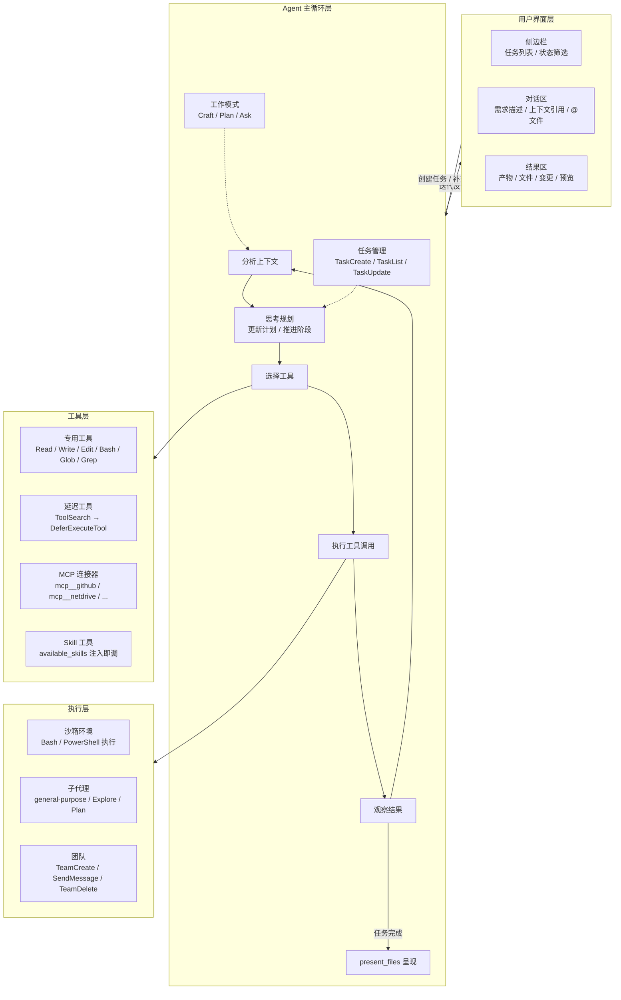
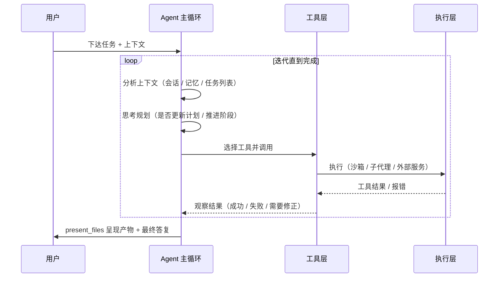

# WorkBuddy Agent 框架解读

> 系列：《WorkBuddy 技术解读》之（二）
> 定位：运转机制——WorkBuddy 作为 agent 如何思考与行动
> 素材来源：WorkBuddy 客户端系统机制一手信息（Agent 框架面）+ 官方文档

---

## 目录

1. [引言：从「对话」到「执行」](#1-引言从对话到执行)
2. [整体架构总览](#2-整体架构总览)
3. [Agent Loop 主循环详解](#3-agent-loop-主循环详解)
4. [三种工作模式：Craft / Plan / Ask](#4-三种工作模式craft--plan--ask)
5. [工具系统与权限模型](#5-工具系统与权限模型)
6. [任务管理机制：复杂任务的骨架](#6-任务管理机制复杂任务的骨架)
7. [子代理体系：并发与分工](#7-子代理体系并发与分工)
8. [团队协作：多 Agent 的群组编排](#8-团队协作多-agent-的群组编排)
9. [上下文工程：系统提示与身份注入](#9-上下文工程系统提示与身份注入)
10. [结果呈现闭环](#10-结果呈现闭环)
11. [总结：设计哲学](#11-总结设计哲学)

---

## 1. 引言：从「对话」到「执行」

传统 AI 助手的本质是「对话引擎」：用户提问，模型回答，交付物停留在文字建议层面，用户仍需自己去完成后续的实际操作。WorkBuddy 的定位与之有本质区别——它是一个**任务执行引擎**。官方将其描述为「说出要求、开始执行任务、交付完整成果」，核心差异可以概括为三点：

- **以任务为单位**：用户的每一次请求被封装为一个「任务」（Task），有明确的生命周期状态（进行中 / 已完成 / 失败 / 待处理 / 规划中 / 已归档），而不是一次性的问答回合。
- **以执行为目的**：模型不只生成文字，而是通过工具系统自动操作本地文件、运行命令、调用外部服务，把「建议」变成「结果」。
- **以交付为终点**：任务完成时必须产生可验收的产物，并通过 `present_files` 等机制呈现给用户，而不是停留在"我建议你这样做"。

这意味着 WorkBuddy 的架构核心不是模型本身，而是**驱动模型反复「思考—行动—观察」的 Agent 框架**。本文档围绕这一框架展开，重点剖析主循环（Agent Loop）、工作模式、工具系统、任务管理、子代理、团队协作、上下文工程与结果呈现这八个运转机制层面。

## 2. 整体架构总览

从用户下达任务到产出结果，WorkBuddy 的运行时可以抽象为四个层次。用户只接触最上层的界面，其余全部由框架自动编排。



各层次职责：

| 层次 | 职责 | 关键机制 |
|---|---|---|
| 用户界面层 | 任务输入、上下文补充、结果查看 | 三区域布局、工作空间、@引用 |
| Agent 主循环层 | 思考与行动的编排中枢 | Loop 迭代、工作模式、任务状态机 |
| 工具层 | 能力边界与统一调用入口 | 专用 / 延迟 / MCP / Skill 四类工具 |
| 执行层 | 实际的环境副作用与并发协作 | 沙箱、子代理、团队 |

## 3. Agent Loop 主循环详解

WorkBuddy 的每次任务推进都运行在一个**闭环迭代**中：分析上下文 → 思考规划 → 选择工具 → 执行 → 观察结果 → 迭代，直到任务完成再进入结果呈现。



### 3.1 分析上下文

每一轮迭代的起点不是用户的最后一句消息，而是**全量上下文的重建**。框架会把以下信息注入模型：

- 当前会话中的历史消息（用户需求、之前的工具调用与结果）；
- 会话开始注入的记忆画像（`<memory>` 块，只读）；
- 当前任务状态与已有的任务列表（`TaskList` 的结果）；
- 可用工具清单与 Skill 清单（`available_skills` 注入）。

这一步决定了 agent 的「视野」：它知道自己是谁、要干什么、手上有什么工具、进度到了哪。

### 3.2 思考规划

分析之后，agent 进入推理环节，核心问题是两个：

1. **是否需要更新计划？** 若当前没有计划或需求发生了变化，则拆解任务、生成步骤列表（通常落成 `TaskCreate` 的结构化任务）；
2. **当前处于哪一阶段，下一步做什么？** 根据已有成果决定「继续推进」「回到上一步修正」「换一条路径」。

规划是轻量且动态的——WorkBuddy 不强制一次规划完所有步骤，而是允许在迭代中反复修正，这与现实任务的不可预测性相匹配。

### 3.3 选择工具

规划出「做什么」后，agent 需要回答「用什么做」。工具选择遵循「描述即文档」的原则：每个工具的名称与描述（tool description）本身被注入上下文，agent 根据当前意图匹配语义最近的工具。选择策略大致是：

- 文件读写用 `Read / Write / Edit`，搜索用 `Glob / Grep`，系统操作用 `Bash / PowerShell`；
- 能力不在专用工具集中时，走 `ToolSearch` 查找延迟工具或 MCP 连接器；
- 任务与某个 Skill 匹配时，**先加载 Skill 再行动**（这是阻塞式要求，优先于任何其他响应）。

### 3.4 执行与观察

工具调用在沙箱中执行并返回结构化结果（输出、错误、退出码）。agent 观察结果后判断：

- **成功且推进** → 回到「思考规划」，更新计划，进入下一阶段；
- **失败** → 分析报错根因，调整参数或更换工具，**重试而非放弃**；
- **能力缺口** → 不得直接声称「做不到」，必须先搜索 Skill / 工具补齐能力。

这一「行动—观察—纠错」的闭环正是 agent 有别于单次生成模型的核心：**它的每一步决策都建立在上一步的真实反馈之上**。

### 3.5 一个贯穿示例：销售数据报告任务

以「把销售数据生成分析报告」为例，主循环的一次完整运转如下：

1. **分析上下文**：识别出用户 @ 引用的 `sales.xlsx` 文件、选定的工作空间目录、用户对报告格式的约束；
2. **规划**：拆解为「读取数据 → 清洗与统计 → 生成图表 → 撰写报告 → 呈现」五个阶段，落成任务列表；
3. **选工具**：读取用 `Read`（或 `Bash` 调用转换脚本），数据统计用 `Bash` + Python，图表用 `show_widget`，报告用 `Write`；
4. **执行与观察**：读取后发现列名与预期不符，观察结果、修正解析逻辑重试；统计阶段生成结果后，再进入报告撰写阶段；
5. **迭代**：写完初稿后读取自检，发现图表未引用数据，补充后结束循环；
6. **呈现**：调用 `present_files` 展示报告与图表，给出自足的最终答复。

## 4. 三种工作模式：Craft / Plan / Ask

同一个主循环在不同工作模式下有不同的行为约束。WorkBuddy 提供三种模式，对应「直接执行」「先方案后执行」「只读问答」三种交互契约。

| 模式 | 机制 | 行为约束 | 适用场景 |
|---|---|---|---|
| **Craft** | You say, I do | 收到指令直接进入执行循环，立即调用工具 | 需求明确、可放心的常规任务（写报告、改文件、批量处理） |
| **Plan** | 先分析设计，用户确认后执行 | 先产出方案/计划，等待用户确认或修改后才动手 | 高成本、高风险或需求模糊的任务（架构设计、大范围重构、对外交付） |
| **Ask** | 只读问答 | 不修改文件、不执行有副作用的命令，仅基于已有信息回答 | 咨询问题、解读代码、查询资料，用户希望零风险地获取答案 |

关键设计点：

- **模式的本质是「执行副作用的审批策略」差异**，而非模型的差异。Ask 模式下 agent 同样分析、同样检索，只是禁止产生持久副作用；
- **Plan 模式把「决策权」显式还给用户**，用一次人工确认换取执行方向的高置信度，避免跑偏后返工；
- 三种模式共享同一套工具系统与主循环，因此可以低成本地让同一个 agent 在不同模式间切换。

## 5. 工具系统与权限模型

工具是 agent 的行动手段，也是整个框架中「能力边界」最集中的体现。WorkBuddy 将工具分为三个类别，外加一个 Skill 体系：

### 5.1 专用工具（Direct Tools）

日常任务最高频使用的一批原生工具，直接在模型上下文中就绪：

- **文件类**：`Read`（读取）、`Write`（创建/覆写）、`Edit`（精确字符串替换）；
- **搜索类**：`Glob`（按模式找文件）、`Grep`（按内容/正则检索）；
- **执行类**：`Bash`、`PowerShell`（在沙箱中运行命令）；
- **编排类**：`TaskCreate / TaskGet / TaskUpdate / TaskList`、`Agent`（子代理）、`SendMessage`（团队通信）、`present_files`（结果呈现）等。

专用工具开箱即用、无加载成本，是主循环中的「主力」。

### 5.2 延迟工具（Deferred Tools）

部分工具（如多模态生成 `ImageGen`、`VideoGen`，以及所有 MCP 工具）以**延迟加载**的方式接入，调用链为两段式：

```
ToolSearch（按名称或关键词检索工具，加载其 schema）
        ↓
DeferExecuteTool（按加载到的 schema 校验参数并执行）
```

这一设计的价值在于**上下文经济性**：工具的描述与参数 schema 若全部常驻上下文，会显著占用 token 预算。延迟工具只在被检索到时才把 schema 注入，同时由 ToolSearch 承担「工具发现」职能——agent 不确定该用什么工具时，先按语义关键词搜索工具库。值得注意的是，`ImageGen / VideoGen` 这类工具还存在积分成本（图约 5–10 积分，视频约 50–100 积分），调用前需要向用户明示费用。

### 5.3 MCP 连接器工具

WorkBuddy 通过 MCP（Model Context Protocol）接入 50+ 官方连接器，统一以 `mcp__` 前缀暴露为工具，例如 `mcp__github`、`mcp__netdrive`、`mcp__wb-issues`、`mcp__agent-mail`、`mcp__wps_calendar`、`mcp__weixinpay`、`mcp__ardot` 等。它们把第三方服务（GitHub 仓库、网盘、任务看板、邮件、日历、支付、设计工具）变为 agent 可直接调用的函数，并支持用户通过 `~/.workbuddy/mcp.json` 自定义 MCP 服务器。这一层是「全场景办公」的技术底座：agent 的能力半径因此从本地文件延伸到整个腾讯及第三方办公生态。

### 5.4 Skill 工具

Skill 是「带方法论的工具包」——由 `SKILL.md` 指令 + 配套流程构成。框架在每次会话开始时把已安装技能清单（`available_skills`）注入上下文，当任务与之匹配时，要求**先调用 Skill 工具加载指令，再按技能工作流执行**（加载是阻塞式、优先于其他响应的）。这使复杂领域操作（PPT 生成、金融数据查询、文档转换、软件工程方法等）能以内聚的方式复用。

### 5.5 权限模型：沙箱 + 升级授权

工具能力越强，风险越大，因此权限模型是工具系统的安全护栏，三层设计：

1. **沙箱执行（默认）**：`Bash / PowerShell` 默认运行在受限沙箱内，限制对系统关键路径与外部网络的访问，从机制上降低误操作与恶意操作的危害半径；
2. **高危操作升级授权**：当 agent 判断任务需要突破沙箱（例如安装系统级软件、修改沙箱外文件）时，必须携带 `dangerouslyDisableSandbox` 标记请求，**该请求必须获得用户明确同意**才会以非沙箱方式执行；
3. **工具描述即文档**：每个工具的描述本身就是使用契约（tool_use 指南），明确其适用范围、参数含义与副作用，既指导 agent 正确调用，也让用户理解某个操作为何发生。

## 6. 任务管理机制：复杂任务的骨架

单个任务内部往往包含多阶段工作（如上面示例的五个阶段）。如果只依赖模型记忆，长任务的进度会随上下文漂移而丢失。WorkBuddy 因此提供结构化任务管理工具，构成 agent 的「任务骨架」：

- **`TaskCreate`**：把规划结果落成可追踪的任务项，记录标题、详细描述与「进行中」提示（activeForm）；
- **`TaskGet`**：取回任务的完整详情（含依赖关系与最新描述），用于在继续处理前回顾上下文；
- **`TaskUpdate`**：更新状态（pending / in_progress / completed / deleted）、修改描述、声明 owner、登记依赖（`addBlockedBy` / `addBlocks`），**每完成一步立即标记**，而不是批量收尾；
- **`TaskList`**：查看全局任务列表与进度，是主循环「思考规划」阶段判断「我在哪、下一步做哪件事」的依据，也是团队/子代理场景下的共享状态源。

这套机制解决三个工程问题：

1. **拆解**：把「一个大任务」编码为「一系列小步骤」，降低单次推理的复杂度；
2. **进度可见**：用户界面侧边栏的任务列表直接由这些状态驱动，用户随时看到 agent 进行到哪一步；
3. **可恢复**：任务被中断（失败 / 用户打断）后，基于 `TaskList` / `TaskGet` 的上下文可无损续跑——这正对应产品层的「继续处理」能力。

一个显式规则是：**任务完成后必须同步标记为 completed**，避免「活儿干完了但状态栏还挂着进行中」的歧义。

## 7. 子代理体系：并发与分工

单一主循环的顺序迭代在高并发的探索性工作中会成为瓶颈。WorkBuddy 通过 `Agent` 工具引入**子代理（sub-agent）**机制，把工作委派给独立运行的子 agent，每个子代理拥有自己的独立上下文与工具视野。

### 7.1 三种内置子代理类型

| 类型 | 能力范围 | 用途 |
|---|---|---|
| **general-purpose** | 全工具可用 | 通用委派，承担相对独立的完整子任务 |
| **Explore** | 只读，聚焦代码库探索 | 让子代理先摸清陌生代码库结构，再回报给主代理，避免主代理盲目翻文件消耗上下文 |
| **Plan** | 规划专用 | 独立产出方案/计划，供主代理评估 |

类型划分本质上是对**子代理上下文与工具权限的裁剪**：探索型子代理只读即可，不需要也不应该获得写入与执行权限。

### 7.2 并行与后台运行

子代理支持 `run_in_background: true` 后台运行：主代理发起后台子代理后不必阻塞等待，可继续处理其他工作，子代理完成时主代理会收到自动通知。典型场景是把「资料检索」「代码探索」「独立模块实现」并行发起，最后汇聚结果——这与多任务并行的产品能力（可同时发起和管理多个任务）在机制上一脉相承。

### 7.3 结果回传

子代理完成工作后，通过消息机制把结论回传给主代理（后台子代理向 `main` 回传结果）。值得注意的是，**子代理的普通文本输出对主代理不可见**，只有显式调用 `SendMessage` 发送的内容才会被主代理接收处理——这保证了回传信息的结构化与相关性，避免无关推理文本污染主代理上下文。

## 8. 团队协作：多 Agent 的群组编排

子代理解决「一个人分身」的问题，团队协作解决「多个人分工」的问题。WorkBuddy 支持以「团队」为单位进行多 Agent 编排，生命周期如下：

```
TeamCreate（建队，成员加入）
      ↓
共享任务列表（所有成员共享同一份 TaskList）
      ↓
SendMessage 通信（message / broadcast / shutdown_request / plan_approval_response）
      ↓
任务完成 → TeamDelete（清理队伍）
```

### 8.1 关键机制

- **共享任务列表**：团队场景下任务列表不再是主代理私有的工作台，而是全体成员共同的状态源。成员通过 `TaskList` 认领未分配、未被阻塞的任务，用 `TaskUpdate` 登记 owner、标记进度——这是团队能够并行而不互相踩踏的协调基础；
- **`SendMessage` 四种消息类型**：
  - `message`：点对点定向消息，指定 recipient；
  - `broadcast`：广播给全员（系统提示其成本随成员数线性增长，**必须克制使用**，仅在全员相关时才用）；
  - `shutdown_request` / `shutdown_response`：优雅关闭协议——成员收到关停请求后须**用工具显式应答**（approve / reject），不能只在文本里说「我关了」；
  - `plan_approval_response`：当受 plan_mode 约束的成员请求方案审批时，其他成员可据此批准或驳回其执行计划；
- **空闲通知**：成员完成任务、进入空闲时会自动向团队发出空闲通知（系统自动发送，无需手动构造结构化 JSON 状态消息），让队长可以判断「谁有空、可以接新活」。

### 8.2 与子代理的差异

子代理是主代理管辖的「下属」，生命周期由主代理的 `Agent` 工具调用控制，没有独立的交互入口；团队成员则是**对等的 peer**，可以相互通信、互相审批计划、共享任务列表。前者适合「把活派下去」，后者适合「多角色协作的长流程」。

## 9. 上下文工程：系统提示与身份注入

Agent 的行为一致性在很大程度上取决于「上下文里装了什么」。WorkBuddy 在会话/任务启动时组装一个复合的上下文环境，主要包括三类注入：

### 9.1 project_context：项目级上下文

会话开始时注入与当前项目/工作空间相关的上下文，让 agent 知道自己在哪个项目、目录结构如何、有什么约定，从而做出与项目语境一致的决策。对代码类任务尤其重要——agent 需要先「进入代码库的语境」再动手。

### 9.2 身份与人格文件注入（identity_context）

WorkBuddy 支持通过身份文件定义 agent 的「人设」，经 `identity_context` 注入：

- **SOUL.md**：人格与行为准则，定义 agent 的沟通风格与价值观边界；
- **IDENTITY.md**：身份定义，说明 agent 是谁、担任什么角色；
- **USER.md**：用户画像，记录用户的偏好与背景，帮助 agent 个性化回应。

这些文件与三层记忆体系（云记忆 / 用户级本地记忆 / Workspace 记忆）共同构成 agent 的「自我认知 + 用户认知」，是行为约束中的软性层。

### 9.3 系统提示约束

主循环每一轮都遵循系统提示中编码的硬性规则，它们直接塑造 agent 行为：

- **工具使用纪律**：能用专用工具就不用 Shell 命令（如读取用 `Read`、搜索用 `Glob/Grep`）；描述工具调用须用中文且说明用途；
- **能力边界规则**：能力缺口必须先搜索技能/工具，禁止未经搜索就宣称「做不到」；浏览器类操作必须加载专用 skill；
- **语言与风格规则**：统一使用简体中文回复；输出简洁、直奔结论，不用填充词；
- **执行纪律**：不做范围外的「顺手改进」（不重构没让改的代码、不为一次性操作造抽象）、不创建多余的文档文件、不对未读文件妄加修改（改前先读）；
- **安全与内容策略**：拒绝政治敏感、色情、违法内容与虚假信息，遵循可容忍范围外拒绝的边界；
- **可用能力注入**：`available_skills` 把已装技能清单注入系统提示，配合 Skill 工具的阻塞式加载，形成「能力目录 → 按需装配」的扩展机制。

上下文工程的本质是**把「好的 agent 行为」从模型玄学变成工程配置**：通过身份文件、项目上下文与系统提示，框架在启动时就规定了 agent 的视角、边界与行为偏好，而非依赖模型临场发挥。

## 10. 结果呈现闭环

任务完成不等于任务结束——结果必须被以用户可感知的方式交付。WorkBuddy 的结果呈现遵循两条规则：

### 10.1 result_presentation：present_files 是唯一入口

`present_files` 是结果呈现的**单入口**：agent 将产物文件（报告、图表、HTML 页面、图片等）批量传给该工具，按「查看优先级」排序后呈现。本地 HTML 文件会被同时打开实时预览并列入产物卡片，`http(s)` URL 则直接在内置浏览器面板打开。产品界面的「结果区」（产物 / 全部文件 / 变更 / 预览等视图）正是对这一入口的消费端。

与之配合的是 `show_widget`（Visualizer）：需要内联可视化（图表、示意图、交互组件）时，可在回复中直接渲染 SVG/HTML 组件，不必产出独立文件。

### 10.2 final_answer_instructions：最终答复必须自足

在产物呈现的同时，agent 的最后一条文字回复被要求**自足**：读者即便不打开任何附件，也应从最终回复中知道任务做了什么、结论是什么、产物在哪里。这避免了「交付了文件但用户看不懂」的信息断层，也把「总结汇报」固化为任务收尾的标准动作。

## 11. 总结：设计哲学

回看整套框架，WorkBuddy 的 agent 化设计可以用三个关键词概括：

1. **自主执行**：从「对话」走向「执行」，主循环让模型以「分析—规划—行动—观察」的方式持续工作，Craft / Plan / Ask 三种模式把「自主程度」做成可调节的旋钮，兼顾效率与安全；
2. **工具调度**：专用工具、延迟工具、MCP 连接器与 Skill 构成四级能力体系，用「ToolSearch 发现 + DeferExecuteTool 装配」的延迟加载控制上下文成本，用「沙箱 + 高危授权 + 描述即文档」的权限模型控制行为风险，让 agent 的能力半径在「无限大」与「绝对安全」之间取得平衡；
3. **进度可见**：任务管理工具把隐性的思考过程外化为结构化的任务状态，子代理与团队协作让工作可以并发展开而依然有序，最后以 `present_files` + 自足答复完成交付闭环——**用户看到的不是一次生成，而是一个可以观察、干预、恢复的完整工作流程**。

这一框架的本质，是把「一个聪明的模型」改造成「一个可信的工作流执行器」：模型负责推理，框架负责结构、秩序与安全。理解这些运转机制，也就理解了为什么 WorkBuddy 能交付「完整成果」而不是「完整建议」。

---

> 系列其余文档：01-功能清单及解读 / 03-记忆技术解读 / 04-Skill 调用技术解读
