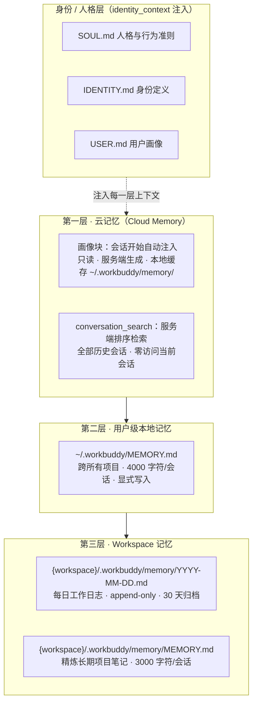

# WorkBuddy Agent 记忆技术解读

> 系列解读之三 · 持久化：agent 如何记住、如何遗忘、如何找回
>
> 面向读者：程序员 / 技术架构师。素材来源：WorkBuddy 客户端系统机制一手信息（2026-08-04 调研）。

---

## 1. 引言：为什么 agent 必须拥有记忆

一个最基本的矛盾构成了所有 agent 记忆系统设计的出发点：

- **底层大模型是无状态的**。每次调用 API 都是独立的推理过程，模型对"上一次对话说了什么""昨天在这个项目里改了什么"一无所知，它的全部"知识"只存在于参数之中。
- **用户期望的 agent 是有状态的**。一个办公智能体需要记住项目约定、沿用历史决策、在后续会话中延续上下文，才能从"一次性问答"升级为"持续协作的同事"。

WorkBuddy 用一套**三层记忆架构**填补这个鸿沟：由服务端云记忆、用户级本地记忆、工作空间级本地记忆组成，辅以身份/人格文件与一整套"何时写、何时读"的策略。这套设计回答的三个问题正是本文的线索：

1. **如何记住**——什么信息写入哪一层、由谁写入；
2. **如何遗忘**——容量限制、瞬态信息过滤、归档维护如何防止记忆膨胀；
3. **如何找回**——检索策略与检索工具如何把"记住的"变成"用得上的"。

需要先声明记忆在整个 agent 架构中的位置：记忆是**执行过程的内生补充**，它辅助上下文构建，但**不替代正式回复与交付物**——agent 对用户的最终输出必须自足（final_answer 自包含），记忆只负责让这些输出"有依据、有连续性"。

---

## 2. 记忆架构总览：三层记忆 + 身份层

WorkBuddy 的记忆体系从"适用范围从小到大"划分为三个层次，外加一组身份/人格文件：



### 分层原则

| 维度 | 第一层 云记忆 | 第二层 用户级 | 第三层 Workspace |
|---|---|---|---|
| 适用范围 | 全局（所有设备/项目） | 跨项目（本机所有项目） | 单项目 |
| 读写权限 | 只读（服务端生成） | 显式写入（用户要求） | agent 主动写 + 用户可维护 |
| 容量限制 | 服务端管理 | 4000 字符/会话 | 日志不限 / MEMORY.md 3000 字符/会话 |
| 持久性 | 云端持久 | 本地持久 | 本地持久 + 30 天归档 |

三个层次不是并列的"存储桶"，而是一条**从冷到热、从宽到窄、从云端到本地的分层瀑布**：

- **越靠下越"常驻"**：云记忆的画像块在每次会话开始时自动注入，属于"天然在上下文里"的热数据；
- **越靠下越"具体"**：从"所有用户的偏好"收缩到"这一个项目的进度"，信息密度逐步上升；
- **越靠下越"可干预"**：云记忆用户无法修改，Workspace 日志则由 agent 与用户共同维护。

**为什么要分层而不是单一大仓库？** 核心考量是**写入/检索的边际成本**：把跨项目规则塞进项目日志，会让单项目检索命中率下降；把项目细节塞进用户级文件，会让所有项目共享同一份噪声。分层的本质是**按作用域隔离信息，按访问频率决定存放位置**。

---

## 3. 第一层：云记忆（Cloud Memory）

云记忆是 WorkBuddy 记忆体系的"最外层"，由服务端托管，对 agent 呈现为两种能力。

### 3.1 自动注入画像：会话开始时的 `<memory>` 块

**机制**：每个会话启动时，服务端会生成一个 `<memory>` 块并自动注入上下文，作为 agent 对"我是谁、用户是谁、长期偏好是什么"的初始认知。这个块：

- **只读**——agent 无法在本会话中修改它；
- **服务端生成**——画像由云端根据历史使用数据与用户资料实时汇总，而非本地手工维护；
- **本地缓存**——内容在 `~/.workbuddy/memory/` 留有缓存副本，以降低注入延迟与网络依赖，但缓存**不可被本地修改**（修改无意义，服务端仍按自身数据生成）。

**架构含义**：这相当于 LLM 的"系统提示词层"，它把记忆从"agent 自己翻找"变为"系统预先喂给"，保证每个会话开局的上下文一致。缓存副本的价值在于离线场景下至少能读到最近一次画像；而"不可本地修改"的设计则杜绝了用户/agent 篡改云端画像造成的漂移。

### 3.2 历史会话检索：conversation_search

当 agent 需要找回跨会话的历史信息时，使用 `conversation_search` 工具：

- **服务端排序检索**：由服务端对全部历史会话做相关性排序，agent 拿到的是排序后的候选而非全部原文；
- **零访问当前会话**：该工具**检索不到正在进行的会话本身**——它是为"跨会话回忆"设计的，无法把当前对话再搜一遍；
- **查询必须自包含**：工具调用对当前上下文一无所知，查询串里必须完整描述"要找的事 + 时间 + 背景"，不能写"就是刚才那个"或"上次说的那个"。

**检索技巧示例**（自包含查询的写法）：

```
❌ 反例：查一下我上次的需求
    —— "上次"是哪个会话？需求是什么？时间范围？都无法定位。

✅ 正例：找 2026 年 7 月我在 Alpha 项目里确定的前端技术栈选型，
   当时讨论过 React vs Vue，最后定了 React + TypeScript。
    —— 事件（技术选型）+ 时间（2026-07）+ 背景（Alpha 项目、React/Vue 对比）
       + 期望结果（最终选型），检索项全部显式给出。
```

`conversation_search` 是 agent 在**跨项目、无本地文件可依赖**时的唯一记忆找回手段，也是三层中唯一"去本地化"的通道——它让一台新设备、一个新工作空间也能接续云端的历史上下文。

---

## 4. 第二层：用户级本地记忆（~/.workbuddy/MEMORY.md）

**位置与作用域**：`~/.workbuddy/MEMORY.md` 位于用户主目录，对所有项目、所有工作空间生效，是"用户希望 agent 到哪都记得"的持久层。

**三个关键约束**：

1. **显式写入**——与 Workspace 层 agent 主动写日志不同，这一层只记录用户**明确要求**长期记住的规则与偏好。典型句式："记住我写代码用 4 空格缩进""所有周报发给我之前先发给张总确认"。agent 不应自作主张把推断出的习惯写进去。
2. **4000 字符/会话**——单个会话最多向该文件写入 4000 字符，防止一次任务把全局记忆灌满，强制 agent 提炼而非堆砌。
3. **纯文本可审计**——它是 Markdown 文件，用户随时可打开查看、修改、删除，记忆内容对用户完全透明。

**适用场景举例**：

- 跨项目代码风格约定（缩进、命名、测试框架）；
- 用户身份信息与称呼偏好（"我是一名数据工程师""邮件签名用 XXX"）；
- 与工具/账号相关的长期规则（"不要在微信群里发测试消息""用钉钉审批走正式流程"）。

**与云记忆的分工**：云记忆的画像块是"系统替你总结的"（只读、服务端生成），而 `~/.workbuddy/MEMORY.md` 是"用户明确要求记的"（可写、本地文件）。两者内容可能重叠，但写入方和可信来源不同——用户文件永远优先于系统推断。

---

## 5. 第三层：Workspace 记忆（{workspace}/.workbuddy/memory/）

Workspace 记忆是作用域最小、内容最具体的一层，全部位于工作空间目录下的 `.workbuddy/memory/` 中，由两种文件组成。

### 5.1 每日工作日志：`YYYY-MM-DD.md`

- **append-only 追加，不覆盖**：每次会话把当天的工作摘要**追加**到以日期命名的文件中，已有的内容原样保留。这是日志系统最核心的不变量——它保证"记忆只增不减"，历史永远可追溯。
- **粒度**：一天一个文件，跨天不混淆；同一项目一天内多次会话共用一份日志，形成时间线。
- **归档维护**：日志按 **30 天**滚动维护——过期日志进入归档，避免目录无限膨胀。这构成"遗忘"机制的重要一环：**日志天然会过期，agent 依赖"最近优先"的读取顺序**，陈旧内容自然降低权重。

### 5.2 精炼长期笔记：`MEMORY.md`

- 同一目录下的 `MEMORY.md` 存放**精炼后的长期项目笔记**——技术选型结论、项目约定、设计决策、踩坑教训；
- **3000 字符/会话限制**：每会话写入上限低于用户级文件，因为项目笔记要求"精炼"，与日志的"完整"形成互补；
- 与日志的关系：日志是**过程流水**（发生了什么），MEMORY.md 是**沉淀结论**（最终定下什么）。agent 应当在完成阶段性工作后，把日志中的关键决策"提炼"进 MEMORY.md，形成两级结构：细节查日志，结论查笔记。

**两个文件为什么拆开？** 日志追求完整性（append-only，量大，可查过程），笔记追求可读性（有上限，随时可整体注入上下文）。若合二为一，要么上下文被流水淹没，要么历史细节丢失。拆分是对"细节保真"与"上下文省 token"两个目标的折中。

---

## 6. 身份与人格文件：SOUL.md / IDENTITY.md / USER.md

在三层记忆之上，还有一组**身份/人格层**文件，通过 `identity_context` 机制注入上下文，回答"agent 以什么姿态工作"：

| 文件 | 内容 | 作用 |
|---|---|---|
| `SOUL.md` | 人格与行为准则 | 定义 agent 的沟通风格、价值取向、边界原则 |
| `IDENTITY.md` | 身份定义 | 定义 agent 的角色定位（如"资深架构师""数据分析专家"） |
| `USER.md` | 用户画像 | 描述用户身份、职业、偏好，供 agent 调整表达与交付方式 |

**注入机制**：这三份文件经 `identity_context` 统一打包注入会话上下文，与云记忆的 `<memory>` 块叠加，共同构成会话的"人格基线"。与三层记忆相比，身份层不关心"做过什么"（事实记忆），只关心"以什么方式存在"（人格预设）——它决定 agent 说话的口吻与判断的立场，而不是它记住的事实。

**与 Expert（专家中心）的关系**：选择某领域专家后，`IDENTITY.md`/`SOUL.md` 的注入内容会随之切换，让 agent 以对应专家的身份与准则处理任务——身份文件是"专家化"的载体，同一套记忆系统在不同人格设定下复用。

---

## 7. 写入策略：何时写、写什么、写哪一层

记忆系统若没有写入纪律，会迅速退化为"垃圾堆"。WorkBuddy 的写入策略可归纳为一套决策规则。

### 7.1 何时写：完成实质工作之后必写

Agent 在**完成有实质产出的工作后，必须写日志**。素材明确列举的触发场景：

- 建站 / 部署；
- 修复 Bug；
- 撰写报告 / 文档；
- 重构 / 技术选型；
- 与用户达成的约定。

判断标准是"**是否产生了值得下个会话接续的事实**"——只要下一个会话"不知道这件事就可能会做错或重做"，就应当写入。临时性的中间过程（读过的文件列表、某次工具调用结果）不构成实质工作，不写。

### 7.2 写什么、不写什么

**该写**：结论、决策、约定、进度、教训、偏好。这些是"跨会话有持续价值"的信息。

**不该写（瞬态信息）**，素材明确点名三类：

1. **搜索结果**——检索是一次性的，结果会变化，无需留存；
2. **临时路径**——本次会话内有效，下次就失效；
3. **工具报错**——错误信息在修复后即失去价值，记它只会污染记忆。

**不存机密**：默认不把密码、Token、密钥、敏感数据写入任何记忆层，除非用户**明确要求**。记忆文件本质是明文本地文件，机密一旦落盘即扩大泄露面——这是记忆写入的红线。

### 7.3 各层选择规则：信息从哪来、往哪去

```
完成实质工作
   │
   ├─ 判断：这是"跨项目长期习惯/用户明确要求记住"吗？
   │     YES → 写入 ~/.workbuddy/MEMORY.md（用户级，显式写入）
   │
   ├─ 判断：这是"本项目的结论/约定"吗？
   │     YES → 写入 {workspace}/.workbuddy/memory/MEMORY.md（项目笔记，精炼）
   │
   └─ 默认：当天发生了什么、进展到哪
         → 追加 {workspace}/.workbuddy/memory/YYYY-MM-DD.md（日志，append-only）
```

三条规则可以这样记忆：**约定归用户级，结论归项目笔记，过程归日志**。

---

## 8. 检索策略：何时读、读哪个源

写入决定记忆"存了什么"，检索决定记忆"能否被用上"。WorkBuddy 的检索策略按**依赖的来源位置**分级：

| 情形 | 读取源 | 依据 |
|---|---|---|
| 任务涉及**当前项目**的历史 | 本地日志 `YYYY-MM-DD.md` + 项目 `MEMORY.md`，**最近优先** | 项目上下文高度相关，且日志天然按时间排序，先读最近日期最省 token |
| 信息**跨项目**或**位置不确定** | `conversation_search`（服务端全量检索） | 本地文件无索引优势，云端排序检索效率更高 |
| 任务**无历史依赖**（全新需求） | **跳过**，不触发任何检索 | 避免无谓的 IO 与上下文污染 |

**设计要点**：

1. **"最近优先"是有依据的**——项目日志 30 天归档，越新的文件命中当前问题的概率越高，倒序读取让召回效率与质量同时最优；
2. **检索是决策不是惯例**——每次读记忆前先自问"这个任务真的需要历史吗"，全新任务读历史反而引入噪声；
3. **检索失败要能优雅降级**——本地没有日志、云端搜不到结果时，agent 应直接基于当前上下文执行，并提示用户补充信息，而不是死等。

**一个综合示例**：用户在 Beta 项目中说"接着上次把部署脚本写完"。agent 的检索路径：先读 `Beta/.workbuddy/memory/` 最近的日志（上次进行到哪一步、遗留了什么问题）→ 命中后按日志续写；若发现部署方案参考了另一项目的经验，再用 `conversation_search` 定位"之前在某项目用过的 CI 方案"，查询串写明事件+时间+背景。整个过程遵循"项目内先查本地，跨项目才上云"的次序。

---

## 9. 记忆与 Skill 的边界：information vs. actionable

记忆与 Skill 是 agent 两大外部资源，但**性质完全不同**，混用会导致架构混乱：

| 维度 | 记忆（Memory） | Skill（技能） |
|---|---|---|
| 本质 | **信息（informational）**：事实、结论、约定 | **可执行工作流（actionable）**：步骤、工具链、方法 |
| 回答的问题 | "以前是怎样的？" | "现在该怎么做？" |
| 载体 | 记忆文件 / 云端画像 / 会话检索 | SKILL.md 指令 + 对应工作流 |
| 触发方式 | 按检索策略读取 | 按 available_skills 匹配后加载执行 |
| 时效性 | 面向过去（沉淀） | 面向未来（复用） |

**典型判断问题**："把某件事写成记忆还是写成 Skill？"

- 用户说"**以后报告都用这个封面模板**"——这是**约定/偏好**，属于记忆（写 MEMORY.md）；
- 用户说"**生成报告时先做数据校验再画图**"——这是**步骤流程**，属于 Skill（沉淀为可复用的工作流）；
- 一句话区分：**记"是什么"用记忆，记"怎么做"用 Skill**。

两者也有关联：完成的多步任务（8+ 工具调用）应当沉淀为 Skill，而 Skill 本身可以引用记忆中的约定作为输入参数——记忆为 Skill 提供上下文，Skill 为记忆中的知识提供执行路径。

---

## 10. 实践建议：用好 WorkBuddy 记忆

基于三层架构与读写策略，给使用者（含 agent 自身与配置 agent 的开发/管理员）几条实操建议：

1. **把"项目约定"主动喂给 agent**：项目开工时明确告知"本项目代码规范是 X、周报格式是 Y"，agent 会将其写入项目 MEMORY.md，后续会话自动遵循，不必反复交代。
2. **善用"接着做"模式**：完成任务后不要急着开新会话，WorkBuddy 支持基于原上下文继续处理。若跨会话续接，依赖日志记录——所以每个关键节点主动要求 agent"把进度写进日志"，形成可持续接续的协作链。
3. **复用历史任务而非重做**：遇到"和上次类似的需求"，让 agent 先 `conversation_search` 找回旧会话中的方案与产物，再增量修改，显著节省时间与 token。
4. **为身份文件做投入**：配置好 SOUL.md（行为准则）与 USER.md（用户画像），会让所有后续会话的沟通成本系统性下降——这是性价比最高的一次性投资。
5. **定期做记忆整理**：项目结束后清理过期日志，合并 MEMORY.md 冗余条目；发现记忆混乱（重复/过时）时主动整理，避免"记忆噪声"稀释检索精度。
6. **守住红线**：机密信息默认不写入记忆文件；确需持久化的敏感信息要明确、单独地要求 agent 处理，并关注存放位置。

---

## 11. 总结

WorkBuddy 的记忆体系是一个**分层、有纪律、可审计**的持久化方案：

- **分层解决作用域**：云记忆（服务端画像 + 全量会话检索）负责全局与跨项目，用户级 `~/.workbuddy/MEMORY.md` 负责跨项目显式规则，Workspace 层用"append-only 日志 + 精炼笔记"负责单项目的过程与结论，身份文件负责"以什么姿态存在"；
- **有纪律解决膨胀**：写入只看实质工作，瞬态信息与机密一律不记；日志 30 天归档、笔记与用户级文件都有每会话字符上限，"遗忘"与"记住"一样被显式设计；
- **可审计保证可信**：记忆全部沉淀为本地明文 Markdown 文件，用户随时可查看与修正，云端画像只读注入防止漂移。

对架构师的启示在于：**agent 的记忆不是"把一切存下来"，而是"在合适的层、以合适的成本、存值得存的信息，并在需要时以最小的代价取回"**。无状态的模型 + 有状态的分层记忆 + 严格的读写纪律，三者共同把 WorkBuddy 从"聪明的对话"推向"可靠的同事"。

---

*本文为「WorkBuddy 技术解读」系列第三篇。系列其他篇目：01 功能全景解读、02 Agent 框架技术解读、04 Skill 调用技术解读。*
