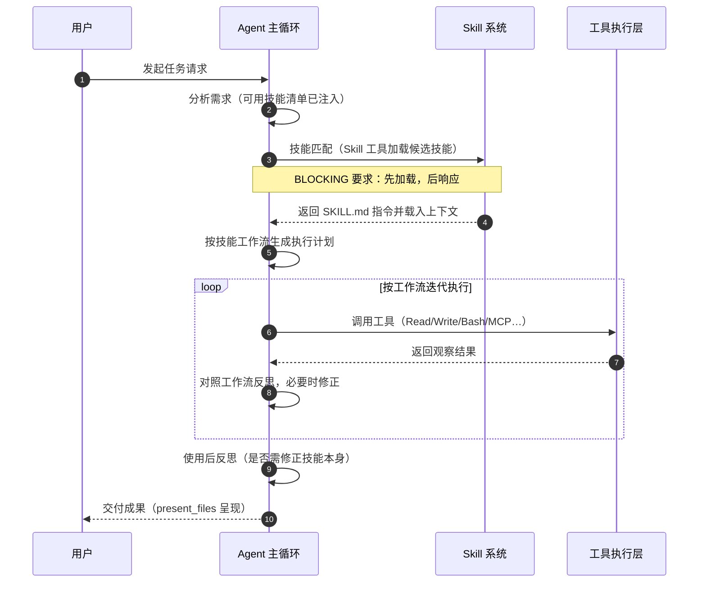

# WorkBuddy Agent Skill 调用技术解读

> 系列解读 · 第四份：能力扩展 —— Agent 如何发现、加载、执行、维护可复用的技能
>
> 素材来源：WorkBuddy 客户端系统机制一手信息（「Skill 面」）+ 官方产品文档，抓取于 2026-08-04

---

## 1. 引言：Skill 在 Agent 体系中的定位

WorkBuddy 的 Agent 主循环是一条经典链路：分析上下文 → 思考规划 → 选择工具 → 执行 → 观察结果 → 迭代。在这条链路里，**工具（Tool）是原子能力**——Read、Write、Bash、MCP 连接器等各自只解决一件事；而一次有价值的办公任务往往需要**多个工具的编排**：例如「把一份合同转成 Markdown 并提炼要点」，涉及文档解析、文本阅读、摘要撰写、结果呈现等多步操作。

如果把这种「验证过的多步工作流」每一次都让 Agent 从头临时编排，会造成三方面浪费：一是每次执行质量不稳定，依赖模型临场发挥；二是相同套路反复消耗 Token 与时间；三是沉淀下来的经验散落在对话里，无法跨任务复用。

Skill（技能）正是为解决这个问题而生：它是把**验证过的工作流沉淀为可复用资产**的机制。一段曾经成功完成任务的指令序列，被固化成一个带有元数据的标准操作程序（SKILL.md），存放在指定目录。此后 Agent 遇到相似任务时，不再「从零开始」，而是先加载该技能，按其既定工作流执行。从工程角度看，Skill 是对 Agent 能力的**模块化封装**——像函数库之于代码：调用方不必关心内部实现，只需匹配签名（描述）并调用。

## 2. Skill 是什么：SKILL.md 结构

### 2.1 形态：一个目录 + 一份 SKILL.md

每个 Skill 的本质是一个目录，目录内核心文件是 `SKILL.md`——这是技能的唯一指令载体。规范上采用「**YAML frontmatter + Markdown 指令正文**」的双段式结构：

```markdown
---
name: my-network-skill
description: 专业的网络工程师技能，覆盖路由交换、无线、网络安全等方向，用于解答网络故障排查、设备配置等问题。
---

## 使用时机
当用户提出网络故障排查、设备配置、协议解释等需求时使用本技能。

## 工作流
1. 确认问题类型（故障/配置/设计）
2. ...
```

- **frontmatter 元数据**：声明技能的 `name`、`description`（描述即匹配依据）、来源信息等。其中 `agent_created` 等标志位还参与权限控制（见 6.3 节）。
- **指令正文**：以 Markdown 编写的操作说明，告诉 Agent 该技能**何时用、怎么用、按什么步骤执行**。它通常包含触发条件、执行工作流、边界约束与注意事项。

### 2.2 frontmatter 的关键字段

虽然不同来源的技能字段略有差异，但规范上几个字段承担着明确职责：

| 字段 | 职责 | 说明 |
|---|---|---|
| `name` | 技能唯一标识 | 用于目录命名与引用，应简短、无歧义 |
| `description` | 匹配与触发依据 | 写入 `available_skills` 清单供 Agent 比对，质量直接决定技能能否被命中 |
| `agent_created` | 修改权限标志 | 仅 `true` 的技能允许 Agent 通过 SkillManage 自行修正（见 6.3） |
| `location` | 来源定位 | 标识技能所在层级目录，供审计与治理使用 |

description 相当于技能的「函数签名」，name 是符号名，指令正文是函数体——一个技能要能被正确调用，签名必须足够精确，否则即使函数体写得再好也永远不会被调用。

### 2.3 与普通指令的区别

| 维度 | 普通对话指令 | Skill |
|---|---|---|
| 生命周期 | 一次性，随对话上下文消失 | 持久化，存于文件系统，跨会话/跨任务存在 |
| 可发现性 | 仅当前上下文可见 | 通过 available_skills 扫描注入，可被任务匹配 |
| 可复用性 | 每次重新表达 | 一次沉淀，多次复用 |
| 可审计性 | 无 | 有元数据与安全分级，安装前强制审计 |
| 可共享性 | 无 | 可打包为市场技能，通过 BuiltinMarket 分发 |

一句话概括：普通指令是「说话」，Skill 是「制度化的操作规程」。

## 3. 分层体系：五层技能的作用域与安装位置

WorkBuddy 的技能并非单层存放，而是按**作用域由小到大、安装位置由业务到系统**分为五层：

| 层级 | 安装位置 | 作用域 | 典型示例 |
|---|---|---|---|
| 项目级 | `{workspace}/.workbuddy/skills/` | 单个工作空间（项目） | 项目专属的构建/发布流程 |
| 用户级 | `~/.workbuddy/skills/` | 跨所有项目（默认安装位置） | codex-delegate、my-network-skill |
| 内置 builtin | 应用资源目录（`builtin-skills/`） | 随客户端分发，全局可用 | tencent-pptx、wb-finance-skill、westock-data、cloudstudio-deploy、expert-manager、marketplace-skill-installer |
| 连接器 skill | `connectors/skills/`（随连接器分发） | 绑定具体连接器 | github（GitHub MCP 连接器配套技能） |
| 市场 skill | 由 BuiltinMarket 推荐市场分发 | 按需安装到用户级 | 社区贡献的各类领域技能 |

各层定位与设计意图：

- **用户级是默认落点**。`~/.workbuddy/skills/` 是「默认安装位置」，用户手动安装或市场安装的技能默认进入此层，保证跨项目一致可用——这与个人偏好的持久化思路一致（`~/.workbuddy/MEMORY.md` 同样承载跨项目信息）。
- **项目级用于隔离**。当某个工作流的适用范围仅限当前项目（如某代码库特有的构建/部署步骤）时，放在 `{workspace}/.workbuddy/skills/`，避免污染其他项目，也方便随项目一起版本化、迁移。
- **内置层由产品随包分发**。应用资源目录内的 builtin 技能（如 PPT 生成、金融数据查询、云部署等）面向高频场景预置，开箱即用，用户无需安装。
- **连接器层绑定生态**。连接器技能（如 github）与 MCP 连接器配套，安装连接器时一并带入，负责把「该连接器能做什么、怎么调」沉淀为操作规范。
- **市场层是扩展入口**。BuiltinMarket 推荐市场承担技能的分发渠道角色，由 `marketplace-skill-installer` 一键安装到用户级，完成「发现 → 安装 → 生效」的闭环。

当存在同名/相似技能时，各层需要有一个生效优先级。通常「项目级 > 用户级 > 内置」是合理的解析顺序——项目内的定制应覆盖全局默认，这与配置文件系统的分层覆盖（layer override）哲学一致。

对 Agent 而言，五层技能对外是一个**统一命名空间**：Agent 无需关心命中技能来自哪一层，只管按 SKILL.md 工作流执行；而分层的价值在于**安装时机、作用范围与治理权**的差异——用户级技能跨项目常驻、项目级技能随项目存亡、内置技能随产品版本更新、连接器技能随连接器启停、市场技能按需增减。这种「统一调用、分层治理」的设计，让技能生态既灵活又不失控。

## 4. 发现与触发机制

技能要发挥作用，关键在「发现」与「触发」两个环节，WorkBuddy 对此有一套显式的机制约定。

### 4.1 发现：available_skills 扫描注入

Agent 启动或进入新会话时，技能系统会**扫描各层技能目录，把可用技能清单注入上下文**（`available_skills`）。这份清单是 Agent 的「技能感知」——Agent 据此知道：本环境里存在哪些技能、各技能 description 写了什么，从而在后续任务中决定是否启用。

这等价于给 Agent 一张「服务目录」（service registry）：不需要在上下文里完整塞入每个技能的全量指令（那会撑爆上下文），只注入**清单 + 描述**，完整指令在命中时才加载（见 4.2）。

### 4.2 触发：任务匹配即加载，且为 BLOCKING 要求

当用户请求与某个技能的描述（capability）匹配时，Agent 必须**立即通过 Skill 工具加载该技能**，且这一动作是 **BLOCKING 要求**——即**先于任何其他响应动作执行**：Agent 不得先给出泛泛答复、不得先跳去执行别的操作，而是先把该技能对应的 `SKILL.md` 指令载入上下文，再基于工作流行事。

这条规则的意义在于强制 Agent「**先看规程、再动手**」。它把「用不用技能」从模型的主观偏好提升为协议级约束：凡命中技能描述的任务，加载技能是指令性的，不是可选项。加载后，SKILL.md 正文成为上下文的一部分，Agent 据此生成执行计划、调用工具、验证产出。

### 4.3 能力缺口处理：先 find-skills 搜索，再言放弃

触发机制的另一面是**能力缺口（capability gap）**的处置：当任务超出当前已加载技能与工具的能力时，Agent **必须先调用 find-skills 进行搜索**，确认没有现成技能可用之后，才允许向用户说明「做不到」或「无相应能力」。

这是一个防「摆烂」约束：它禁止 Agent 未经检索就声称能力不足。能力的边界必须由一次实际搜索来界定，而非模型的主观判断——搜索过程可能在本地各层技能目录、也可能在 BuiltinMarket 市场里寻找。只有「已搜索、无命中、且无替代方案」三者齐备，才构成真实的放弃条件。

### 4.4 浏览器操作：agent-browser 强制加载

在工具层面还有一个明确的强制映射：**凡是涉及浏览器操作的任务，必须加载 agent-browser 技能**。浏览器类操作（网页访问、自动化交互等）在 WorkBuddy 中被视为一个相对独立的执行域，Agent 不能自行「发明」浏览器操作方式，而应统一走 agent-browser 提供的标准工作流，保证操作的可控性与可审计性。

### 4.5 触发判定的语义逻辑

综合 4.2–4.4，Agent 在收到任务后对技能系统的判定大致是一棵决策树：

```
任务请求
 ├─ 命中某技能 description？ ──是──▶ 加载该技能（BLOCKING）→ 按工作流执行
 └─ 否，存在能力缺口？
      ├─ 涉及浏览器操作？ ──是──▶ 加载 agent-browser 技能
      ├─ 先 find-skills 搜索本地各层 + 市场
      │    ├─ 搜索命中？ ──是──▶ 加载技能执行
      │    └─ 未命中 → 才允许向用户声明能力不足
```

这条决策树的关键点在于：**放弃是一个需要先穷尽搜索才能做出的结论**，而加载则是命中即触发的高优先级动作。能力扩展（Skill）与能力边界（放弃）被同一套机制显式管控，杜绝了 Agent 随意「推活」或随意「硬上」两个极端。

## 5. 调用链路时序图

将上述发现、加载、执行、交付串起来，一次完整的 Skill 调用如下：



链路要点：

1. **匹配先行**：Agent 在理解需求后，对照 `available_skills` 清单做匹配，命中即进入加载分支。
2. **加载强制**：Skill 工具加载是 BLOCKING 的，先于任何其他响应。
3. **执行受控**：后续工具调用不再是自由发挥，而是「沿工作流」执行；反思环节同时评估「执行偏离」与「技能本身缺陷」。
4. **结果交付**：执行完毕后按平台惯例用 `present_files` 呈现产物，任务闭环。

## 6. 生命周期管理：从创建到淘汰

技能不是一次写定永久有效的死资产，而是一个有创建、审计、修正、沉淀、治理的活系统。

### 6.1 创建：skill-creator

新技能的创建与既有技能的更新统一通过 **skill-creator** 完成。它承担「把工作流固化成标准 SKILL.md」的元能力：将散落在对话里的成功经验提炼为规范的技能文件，写入对应层级目录。这是「沉淀」动作的入口工具。

### 6.2 安全审计：skills-security-check（强制关卡）

技能的本质是可执行指令，它可能携带**危险的 Shell 命令、数据外发、恶意路径**等风险。因此在**安装、创建、导入任何技能之前**，必须经过 **skills-security-check** 安全审计。审计按风险给出三级结论：

| 分级 | 含义 | 处置策略 |
|---|---|---|
| P0 | 高风险（如命令注入、明显恶意行为） | 强烈警告并建议**不安装** |
| P1 | 中风险（行为存疑，需人工判断） | 警告，**需用户确认**后方可安装 |
| P2 | 低风险 | **正常安装** |

P0/P1 的存在说明：技能加载不是无条件的信任，而是**安全边界内的放行**。这个强制审计与平台整体的权限模型（沙箱执行 + 高危操作升级授权）一脉相承——能力扩展得越多，安全校验越不能缺席。

### 6.3 反思修正：SkillManage

技能在真实使用中可能暴露出步骤缺失、指令含糊、触发词不准等问题。机制上要求：

- **每次使用技能后必须反思**：工作流是否顺畅、产出是否达标；
- **发现问题应立即通过 SkillManage 修正**，而非把缺陷技能留在原位继续带病运行；
- **修正权限受控**：仅允许修改 `agent_created: true`（由 Agent 创建的）技能，防止误改用户手动编写/市场安装的技能——这是「Agent 可以自我进化，但不能越权篡改用户资产」的边界设计。

### 6.4 沉淀规则：多步任务之后

何时该把一段流程沉淀为技能？规则给出了量化判据：**当一个任务涉及 8 次以上工具调用（多步任务）时，完成后应将其沉淀为技能**。8+ 是一个实用的复杂度阈值——低于它，临时编排的成本可接受；达到它，说明该流程已足够复杂、足够可能被复用，值得固化为资产。这与代码工程里「规则到第三次才抽象」的务实原则不同，平台选择更早介入，以更积极地积累可复用能力。

### 6.5 组织管理：治理而不擅动

技能积累到一定规模后可能出现**重复、边界不清、过时**等混乱。此时 Agent 的正确动作是：**提醒用户整理**，给出治理建议（哪些重复可合并、哪些边界重叠需划清、哪些过时可归档），而**不擅自批量重构**用户技能。技能目录是用户的资产，Agent 可以当「运维观察者」和「建议者」，不能当「擅自重构的执行者」——这与不擅自删除用户文件、不擅自批量修改的总体原则一致。

## 7. Skill 与 MCP / 连接器 / 专家 / 记忆的关系与边界

WorkBuddy 的能力扩展体系里有几个容易混淆的概念，其边界值得厘清：

- **Skill 与 MCP 工具**：MCP 提供的是原子工具（`mcp__` 前缀，如 github、agent-mail、wps_calendar），Skill 是工具之上的编排层。MCP 管「能调什么」，Skill 管「怎么调成一件完整的事」。
- **Skill 与连接器**：**连接器技能走 MCP 工具**。连接器（如 GitHub 连接器）通过 MCP 暴露能力，配套的连接器 skill 则把「如何用这些 MCP 工具完成典型任务」沉淀为工作流——二者是「通路」与「驾驶手册」的关系。用户自定义 MCP（`~/.workbuddy/mcp.json`）同理，只新增通路，工作流仍靠 Skill 组织。
- **Skill 与专家（Expert Center）**：专家是**领域对话入口**——100+ 领域专家以对话形态提供专业支持，侧重「咨询与问答」；Skill 是**执行流程**——侧重「让 Agent 按既定步骤完成任务」。专家可以「说给你听」，技能是「替你按流程做」。
- **Skill 与记忆**：这是最容易混淆的一对。**记忆是信息，Skill 是可执行工作流**。记忆（三层记忆架构 + SOUL/IDENTITY/USER 身份文件）沉淀的是「事实、偏好、画像、历史」，是**陈述性知识**；技能沉淀的是「步骤、时机、工具编排」，是**程序性知识**。前者回答「用户是谁、做过什么、喜欢什么」，后者回答「这类任务该怎么做」。一条记忆不会驱动 Agent 执行，一份 SKILL.md 则直接指导执行。

## 8. 技能生态实例：本机已装技能一览

以本机（WorkBuddy 客户端）实际安装的技能为例，观察技能如何覆盖不同场景：

| 技能 | 类别 | 解决的场景 |
|---|---|---|
| codex-delegate | 委派 | 把编码任务委派给本地 codex CLI 执行，模型推理计费走用户的 codex 计划，**省 WorkBuddy 侧 Token** |
| my-network-skill | 领域专家类 | 网络工程师技能：路由交换、无线、安全、云计算、光传输五大方向，承接设备故障排查、配置、协议解释等问答 |
| humanizer | 文本处理 | **去 AI 味**：检测并修复 AI 高频词、过度结构化、机械化连接词等痕迹，让产出更像人类写作 |
| markitdown-skill | 文档转换 | 借助 MarkItDown CLI 将 PDF/Word/PPT/Excel/图片/音视频等转换为 Markdown，是文档处理流水线的基础环节 |
| superpowers | 开发方法论 | 完整的软件开发方法学与技能组合体系，为编码任务提供结构化的、可重复的工作流程 |
| kdocs | 云文档办公 | 操作金山文档（Kdocs）云文档：新建/读取/编辑/搜索/分享/整理在线文档与知识库 |
| github（连接器） | 连接器技能 | 通过 GitHub MCP 访问仓库、Issue、PR、Code Search 等能力，把 GitHub 操作固化为标准流程 |

此外，内置 builtin 层还预置了若干面向高频场景的技能，如 **tencent-pptx**（演示文稿生成）、**wb-finance-skill / westock-data**（金融数据查询）、**cloudstudio-deploy**（静态站点云部署）、**expert-manager**（专家包运营）、**marketplace-skill-installer**（市场安装入口）等，形成「内置能力打底 + 用户/市场技能按需扩展」的生态结构。

这批实例呈现了技能生态的三个典型角色：**基础工具增强型**（markitdown、kdocs 扩展文档处理能力）、**领域知识型**（my-network-skill 引入专业领域方法论）、**流程/经济型**（codex-delegate 优化调用成本、superpowers 规范化开发流程）——同一套机制承载了功能、知识与成本三类价值。

### 8.1 从实例看技能的设计思路

- **codex-delegate 是「经济型技能」的范本**。它没有新增任何平台没有的能力，而是把「编码任务交由 codex CLI 执行」这一流程固化，让计费模型落在用户自己的 codex 计划上，直接降低 WorkBuddy 侧 Token 消耗。这说明技能的价值不一定是「新能力」，也可以是「更优的执行路径」——与缓存、路由优化同属成本治理手段。
- **humanizer 是「标准化工序」的范本**。它把「去除 AI 写作痕迹」这一模糊目标拆解为可执行检查项（AI 高频词、过度结构化、机械化连接词、公式化结尾等），让 Agent 按清单逐项修复。模糊目标 → 结构化检查单，正是技能封装工作的典型手法。
- **github 连接器技能展示了「通路 + 手册」的配套模式**。GitHub MCP 提供工具通路，连接器技能提供操作手册（如何搜索代码、如何开 PR、如何审查），二者缺一不可——这也解释了为什么连接器层技能会随连接器一起分发。

## 9. 最佳实践：如何设计一个好的 Skill

结合触发机制与生命周期约束，设计技能时应遵循以下原则：

1. **单一职责**。一个技能只解决一类任务。把「网络故障排查」与「PPT 生成」塞进同一个技能会让 description 匹配失焦、工作流混乱。边界不清是技能治理问题的头号来源。
2. **指令自足（self-contained）**。SKILL.md 应当独立于编写时的对话上下文即可理解——触发条件、执行步骤、边界约束都要在文件内写清楚，不得依赖「当时上下文里说过的话」。因为加载技能时，原始对话可能早已不在了。
3. **明确触发词与描述**。description 是匹配的核心依据，应写得**具体、可检索、含关键词**（如「网络故障排查」「去 AI 味」「文档转 Markdown」）。描述含糊 = 匹配失效 = 技能永远不被调用。
4. **安全优先**。含 Shell 命令或网络行为的技能，作者应预判 P0/P1 审计点：不用危险拼接、不误导审计；使用者应在审计通过后再安装。
5. **及时沉淀、持续修正**。达到 8+ 工具调用的任务后立即沉淀；每次使用后反思，缺陷用 SkillManage 修正（仅限自己创建的技能），避免缺陷技能长期带病运行。
6. **尊重治理边界**。积累混乱时提醒用户整理、提出合并/划界/归档建议，而不是擅自批量重构。

### 9.1 常见反模式

反向列举几个应当避免的设计，便于自查：

- **「万金油」技能**：description 写得过宽（如「处理各种文档」），任何任务都可能命中，加载后工作流却对不上具体场景——比不加载更糟，既浪费上下文又降低执行质量。
- **上下文依赖型指令**：正文里出现「按照刚才说的」「如我们之前讨论」之类表述，技能脱离编写会话后即失效，违背自足原则。
- **步骤过细或过粗**：细到把每个工具参数都写死，场景一变就失效；粗到只有一句「做好这件事」，等于没有封装。
- **跳过审计直接安装**：对来源不明的技能绕过 skills-security-check，等于把不可信指令直接放行到沙箱执行边界内。
- **沉淀过晚或过早**：不足 8 次工具调用就沉淀，维护成本高于复用收益；已成规律的多步流程却不沉淀，每次重复消耗 Token。

好的技能设计本质上是一次「**经验工程化**」：把一次成功执行中的可复用部分提取出来，用最小的指令成本换取最大的可复用收益。

## 10. 总结

回顾全篇，WorkBuddy 的 Skill 体系可以概括为「**一套机制、两条原则、三个闭环**」：

- **一套机制**：以 SKILL.md（frontmatter + 指令正文）为载体的五层技能体系——用户级默认、项目级隔离、内置打底、连接器配套、市场分发。
- **两条原则**：**先加载后响应**（BLOCKING 匹配加载，强制按规程执行）；**先搜索后放弃**（能力缺口必须先 find-skills，浏览器操作必须走 agent-browser）。
- **三个闭环**：**创建→审计→执行→反思→修正**的生命周期闭环（skill-creator 创建、skills-security-check 分级把关、SkillManage 受控修正）；**任务→匹配→加载→执行→交付**的调用闭环；**多步任务→沉淀→复用→再沉淀**的资产积累闭环。

Skill 让 Agent 的能力从「每次临场发挥」进化为「按标准作业程序执行」：知识交给记忆，原子能力交给工具与 MCP，而两者之间那个「怎么做成事」的空隙，正是 Skill 填补的位置。对于希望让 AI Agent 真正沉淀组织经验的团队而言，Skill 机制给出的启示是：**把能力资产化、把资产流程化、把流程受控化**——这既是技术设计，也是工程治理。

---

*本文为《WorkBuddy 技术解读》系列第四份，素材基于 WorkBuddy 客户端系统机制一手信息整理，仅供参考。*
