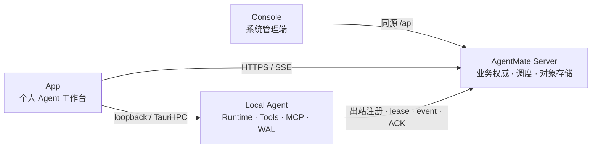

# AgentMate Server-first 当前架构

> 状态：当前权威架构，更新于 2026-08-10。Server-first 业务主链已经落地；存量本地业务表和旧同步代码的退役由
> [WB-437](issues/WB-437-server-first-data-migration-retirement.md) 单独跟踪，不得作为新功能样板。
> 数据红线以 [`agentmate-数据分层与同步规范.md`](agentmate-数据分层与同步规范.md) 为准。

## 1. 产品决策

AgentMate 由四个职责独立的产品面组成：

| 组件 | 定位 | 负责 | 不负责 |
|---|---|---|---|
| AgentMate Server | 控制平面与业务权威 | 身份、组织、项目、任务、会话、Run、资产、调度、事件和审计 | 直接操作用户设备 |
| Console | 整个系统的管理端 | 平台、组织、项目结构、成员、目录、自动化、设备舰队、成本和审计治理 | 日常个人 Agent 工作、本机凭据和文件执行 |
| App | 普通用户的个人 Agent 工作台 | 组织任务、发起和控制 Run、回答/授权、查看过程、交付验收、本机能力与诊断 | 复制 Console 的系统管理信息架构 |
| Local Agent | 设备上的后台执行节点 | LLM/工具/MCP、文件与进程、设备秘密、working copy、lease 和事件 WAL | 提供业务 CRUD、账号权威或 App UI |

一句话边界：**Console 管系统，App 让用户完成工作，Local Agent 在设备上执行，Server 保存业务真相并协调它们。**

## 2. 运行拓扑



Server 不主动连接设备。Local Agent 主动注册、心跳和领取 Run；所有命令都受 owner、device、lease epoch、协议版本和本机权限门禁约束。

## 3. App 的完整工作闭环

App 是主要用户入口，当前必须同时覆盖以下能力：

1. **工作入口**：查看当前用户的项目任务、Session、Run、需要关注和最近完成记录。
2. **执行控制**：发起 Run；对同一 Run 进行暂停、恢复和取消；失败或取消后可显式重试为新 Run。
3. **过程监督**：回放 Server Run 的 `think`、计划、工具、文件、diff、用量、产物、错误和终态事件。
4. **人在回路**：回答 `ask_user`；对高风险工具选择允许一次、当前会话允许或拒绝。
5. **交付验收**：Local Agent 上传产物，Server 校验并形成交付记录；用户在 App 验收后完成任务。
6. **本机能力**：管理模型、Skill、设备运行设置以及本机 MCP/连接器实例和加密凭据。
7. **诊断恢复**：查看设备身份、Server 配置、lease、WAL/ACK、worker、连接器和 working copy，并执行边界明确的安全恢复。

“思考”仅指 Agent 主动输出的可见 `think` 事件，不展示或承诺模型隐藏推理。App 中所有状态必须来自 Server 或 Local Agent 的真实数据，不能由目录卡或前端乐观文案伪造。

## 4. Run 生命周期

### 4.1 权威状态

```text
queued → leased → running ─┬→ waiting_user → running
                           ├→ paused → running
                           ├→ completed
                           ├→ failed
                           └→ cancelled

lease 失效：leased/running → recoverable → 新 lease epoch
```

- `pause`：非终态命令。Local Agent 先让已经开始的模型/工具步骤到达事件边界，再关闭执行门、持续续租并提交 `run.paused` 确认；确认后不再提交执行事件，暂停墙钟时间不消耗活跃执行超时预算。
- `resume`：仅在活动 lease 上恢复同一 `run_id` 和原协程。暂停期间 lease 丢失且没有可验证 checkpoint 时必须 fail closed，原 Run 进入可见失败态，由用户显式重试为带 `retry_of` 的新 Run，不能把从头执行伪装成恢复。
- `cancel`：终态命令。Local Agent 停止 runtime 并提交 cancelled；终态 Run 不可恢复，只能创建带 `retry_of` 的新 Run。
- `waiting_user`：由问题事件挂起，回答以持久命令返回当前 lease，不等同于用户暂停。

App 不自行猜测权威状态；执行控件等待 Server/Local Agent 确认。重复命令、旧 epoch 事件和相同事件重投必须幂等或 fail closed。

## 5. Local Agent 执行与可靠传输

Local Agent 负责：

- 使用设备 Ed25519 身份和独立 Device token 连接 Server；
- 领取一个匹配 owner、目标设备和 capability 的 Run；
- 运行真实 LLM function-calling、工具、MCP、文件与浏览器操作；
- 事件先写本机 WAL，再按 `(run_id, lease_epoch, sequence)` 发送；
- 收到 ACK 后清除相应 WAL，断线时保留并重传原事件；Server 签发更高 epoch 时，旧 epoch 事件移入本地审计归档，不再作为可重试事件误报；
- 将产物作为 working copy 上传，Server 完成 hash、大小和归属校验后提交。

Local Agent 不允许把业务 CRUD 失败降级成本地成功。Server 不可达时只能继续仍有有效 lease 的执行，并把事件留在 WAL。

## 6. 本机 MCP 与连接器

连接器分为两层：

- **Server Catalog**：展示、推荐和兼容元数据；不能下发任意可执行命令或个人凭据。
- **Local Agent 实例**：真实启动定义、启停、工具发现、健康状态和加密凭据，是本机执行权威。

App 支持内置连接器和 owner 隔离的自定义 stdio、HTTP/SSE MCP。自定义实例只有配置完整、启用且通过真实握手/工具发现后才能加入 Run loadout。凭据写入本机加密存储，响应只返回“是否已配置”；stdio 子进程只获得安全基础环境和该实例声明的凭据，不能继承整个后端环境。

未在本机注册或未通过健康检查的目录项必须禁用并说明原因，不能选择后静默 no-op。

## 7. 执行诊断与恢复

App 的执行诊断中心聚合真实证据：

- Server 是否配置、当前账号是否绑定有效设备身份；
- 活动/终态 lease、epoch、ACK 高水位和传输错误；
- WAL 数量、字节、最旧时间、尝试次数及关联 Run；
- 后台 worker 连续失败、连接器健康、working copy 和 staged input；
- 当前设备运行设置来源和协议版本。

允许的自动恢复只有幂等、非破坏操作：重新检测、刷新设备注册、重试心跳/WAL 传输、清理已获 ACK 的终态 lease 缓存。删除工作文件、丢弃 WAL、撤销设备或取消 Run 必须使用各自的显式业务操作，不能由“一键修复”暗中执行。

## 8. Console 边界

Console 维护：

- 平台账号、组织、成员、角色和邀请；
- 项目结构、里程碑、Sprint、自动化和团队协作；
- 专家、连接器、Skill 与工具目录、发布、灰度、撤回和兼容策略；
- 设备舰队、全局 Run、成本、通知和审计。

App 可以推进当前任务所需的状态、评论、回答和验收，但不维护另一套组织、目录、自动化或审计管理页。需要治理时打开 Console。

## 9. 安全边界

- App、Console 使用用户 Bearer；Local Agent 使用独立 Device token；外部服务使用 scoped service identity，三者不能混用。
- LLM key、MCP/连接器 secret、OS 权限和本机真实路径不上传 Server。
- Server deployment secret 不下发 Local Agent。
- 高风险工具由本机执行策略确认；“当前会话允许”只绑定 owner + session +权限集合，重启或扩大权限后重新确认。
- Local Agent 控制面只绑定 loopback，并由 Tauri IPC 随机 token 或认证后的本机 App API 保护。
- 事件和错误在进入 Server 前做 secret 字段拒绝、大小限制和安全摘要。

## 10. 兼容代码退役

`backend/` 仍保留历史目录名和部分本地业务表，仅为迁移与代码兼容。WB-437 完成前遵守：

1. 不为新业务实体增加本地权威、双写、LWW 或冲突合并。
2. App 新业务读取/写入直接使用 Server API；Local Agent 只持久化执行数据。
3. 存量导入必须只读扫描、加密备份、幂等写入和逐类 readback。
4. 旧机制删除前通过协议门禁阻止旧客户端重新制造本地业务写。
5. 回滚暂停新写或恢复隔离备份，不能回到双主。

具体操作见 [`server-first-migration-runbook.md`](server-first-migration-runbook.md)。

## 11. 验收原则

- 页面存在不等于能力完成；必须验证真实 API、持久状态、事件和恢复行为。
- Run 控制验证同一 run_id、暂停无新增事件、恢复/取消确认和旧 epoch fencing。
- 连接器验证真实 MCP handshake、工具发现、凭据不回显和 Run 调用。
- 诊断验证离线、WAL 积压、能力缺失与 worker 失败，不用 mock 健康替代。
- UI 修改检查明暗主题与 390px 窄屏；后端运行时修改硬重启后做真实请求。
- 版本完成度和残余风险记录在 issue；发布声称遵守 RC 门禁。
