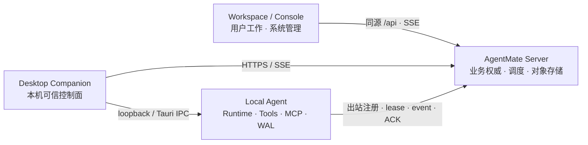
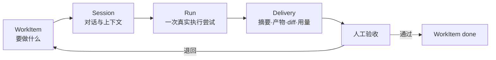

# AgentMate Server-first 当前架构

> 状态：当前权威架构，更新于 2026-08-11。Server-first 业务主链已经落地；WB-517 开始把独立 App 业务面
> 收敛为 Server Workspace + Desktop Companion。存量本地业务表和旧同步代码的退役由
> [WB-437](issues/WB-437-server-first-data-migration-retirement.md) 单独跟踪，不得作为新功能样板。
> 数据红线以 [`agentmate-数据分层与同步规范.md`](agentmate-数据分层与同步规范.md) 为准。

## 1. 产品决策

AgentMate 最终由 Server 业务平台、两种 Web 界面和可部署的 Agent 执行节点组成：

| 组件 | 定位 | 负责 | 不负责 |
|---|---|---|---|
| AgentMate Server | 控制平面与业务权威 | 身份、组织、项目、任务、会话、Run、资产、调度、事件和审计 | 直接操作用户设备 |
| Workspace | 普通用户的 Server 工作界面 | 行动项、对话、Run 监督、任务推进、交付与验收 | 持有本机凭据或直接操作设备 |
| Console | 整个系统的管理端 | 平台、组织、项目结构、成员、目录、自动化、设备舰队、成本和审计治理 | 日常个人 Agent 工作、本机凭据和文件执行 |
| Desktop Companion | 执行节点的可信本机控制面 | 本机授权、模型/Skill/MCP/凭据、文件、诊断、托盘和更新 | 维护第二套 Server 业务界面 |
| Local Agent | 个人电脑或专用机器上的后台执行节点 | LLM/工具/MCP、文件与进程、设备秘密、working copy、lease 和事件 WAL | 提供业务 CRUD、账号权威或用户业务 UI |

一句话边界：**Workspace 让用户完成工作，Console 管系统，Local Agent 在执行节点运行，Desktop Companion 守住本机信任边界，Server 保存业务真相并协调它们。**

## 2. 运行拓扑



Server 不主动连接设备。Local Agent 主动注册、心跳和领取 Run；所有命令都受 owner、device、lease epoch、协议版本和本机权限门禁约束。

## 3. Workspace 与 Desktop Companion 的工作闭环

Workspace 是主要用户入口；Desktop Companion 只承接必须发生在执行节点上的可信操作：

1. **工作入口**：查看当前用户的项目任务、Session、Run、需要关注和最近完成记录。
2. **执行控制**：发起 Run；对同一 Run 进行暂停、恢复和取消；失败或取消后可显式重试为新 Run。
3. **过程监督**：回放 Server Run 的 `think`、计划、工具、文件、diff、用量、产物、错误和终态事件。
4. **人在回路**：Workspace 展示权威等待状态；普通问题可由 Server 持久命令回答，高风险本机工具必须在 Desktop Companion 允许一次、当前会话允许或拒绝。
5. **交付验收**：Local Agent 上传产物，Server 校验并形成交付记录；用户在 Workspace 验收后完成任务。
6. **本机能力**：Desktop Companion 管理模型、Skill、设备运行设置以及本机 MCP/连接器实例和加密凭据。
7. **诊断恢复**：Desktop Companion 查看设备身份、Server 配置、lease、WAL/ACK、worker、连接器和 working copy，并执行边界明确的安全恢复。

“思考”仅指 Agent 主动输出的可见 `think` 事件，不展示或承诺模型隐藏推理。Workspace 与 Desktop Companion 中所有状态必须来自 Server 或 Local Agent 的真实数据，不能由目录卡或前端乐观文案伪造。

## 4. Run 生命周期

### 4.1 权威状态

```text
queued → leased → running ─┬→ waiting_user → running
                           ├→ paused → running
                           ├→ completed
                           ├→ failed
                           └→ cancelled

lease 失效：leased/running → recoverable → 新 lease epoch
```

- `pause`：非终态命令。Local Agent 先让已经开始的模型/工具步骤到达事件边界，再关闭执行门、持续续租并提交 `run.paused` 确认；确认后不再提交执行事件，暂停墙钟时间不消耗活跃执行超时预算。
- `resume`：仅在活动 lease 上恢复同一 `run_id` 和原协程。暂停期间 lease 丢失且没有可验证 checkpoint 时必须 fail closed，原 Run 进入可见失败态，由用户显式重试为带 `retry_of` 的新 Run，不能把从头执行伪装成恢复。
- `cancel`：终态命令。Local Agent 停止 runtime 并提交 cancelled；终态 Run 不可恢复，只能创建带 `retry_of` 的新 Run。
- `waiting_user`：由问题事件挂起，回答以持久命令返回当前 lease，不等同于用户暂停。

Workspace 不自行猜测权威状态；执行控件等待 Server/Local Agent 确认。重复命令、旧 epoch 事件和相同事件重投必须幂等或 fail closed。

## 5. Local Agent 执行与可靠传输

Local Agent 负责：

- 使用设备 Ed25519 身份和独立 Device token 连接 Server；
- 领取一个匹配 owner、目标设备和 capability 的 Run；
- 运行真实 LLM function-calling、工具、MCP、文件与浏览器操作；
- 事件先写本机 WAL，再按 `(run_id, lease_epoch, sequence)` 发送；
- 收到 ACK 后清除相应 WAL，断线时保留并重传原事件；Server 签发更高 epoch 时，旧 epoch 事件移入本地审计归档，不再作为可重试事件误报；
- 将产物作为 working copy 上传，Server 完成 hash、大小和归属校验后提交。

Local Agent 不允许把业务 CRUD 失败降级成本地成功。Server 不可达时只能继续仍有有效 lease 的执行，并把事件留在 WAL。

## 6. 本机 MCP 与连接器

连接器分为两层：

- **Server Catalog**：展示、推荐和兼容元数据；不能下发任意可执行命令或个人凭据。
- **Local Agent 实例**：真实启动定义、启停、工具发现、健康状态和加密凭据，是本机执行权威。

Desktop Companion 支持内置连接器和 owner 隔离的自定义 stdio、HTTP/SSE MCP。自定义实例只有配置完整、启用且通过真实握手/工具发现后才能加入 Run loadout。凭据写入本机加密存储，响应只返回“是否已配置”；stdio 子进程只获得安全基础环境和该实例声明的凭据，不能继承整个后端环境。

未在本机注册或未通过健康检查的目录项必须禁用并说明原因，不能选择后静默 no-op。

## 7. 执行诊断与恢复

Desktop Companion 的执行诊断中心聚合真实证据：

- Server 是否配置、当前账号是否绑定有效设备身份；
- 活动/终态 lease、epoch、ACK 高水位和传输错误；
- WAL 数量、字节、最旧时间、尝试次数及关联 Run；
- 后台 worker 连续失败、连接器健康、working copy 和 staged input；
- 当前设备运行设置来源和协议版本。

允许的自动恢复只有幂等、非破坏操作：重新检测、刷新设备注册、重试心跳/WAL 传输、清理已获 ACK 的终态 lease 缓存。删除工作文件、丢弃 WAL、撤销设备或取消 Run 必须使用各自的显式业务操作，不能由“一键修复”暗中执行。

## 8. Console 边界

Console 维护：

- 平台账号、组织、成员、角色和邀请；
- 项目结构、里程碑、Sprint、自动化和团队协作；
- 专家、连接器、Skill 与工具目录、发布、灰度、撤回和兼容策略；
- 设备舰队、全局 Run、成本、通知和审计。

Workspace 可以推进当前任务所需的状态、评论、回答和验收，但不维护另一套组织、目录、自动化或审计管理页。需要治理时进入 Console 管理视图。

## 9. 安全边界

- Workspace、Console、Desktop Companion 使用用户 Bearer；Local Agent 使用独立 Device token；外部服务使用 scoped service identity，身份边界不能混用。
- LLM key、MCP/连接器 secret、OS 权限和本机真实路径不上传 Server。
- Server deployment secret 不下发 Local Agent。
- 高风险工具由本机执行策略确认；“当前会话允许”只绑定 owner + session +权限集合，重启或扩大权限后重新确认。
- Local Agent 控制面只绑定 loopback，并由 Tauri IPC 随机 token 或认证后的 Desktop Companion API 保护。
- 事件和错误在进入 Server 前做 secret 字段拒绝、大小限制和安全摘要。

## 10. 兼容代码退役

`backend/` 仍保留历史目录名和部分本地业务表，仅为迁移与代码兼容。WB-437 完成前遵守：

1. 不为新业务实体增加本地权威、双写、LWW 或冲突合并。
2. Workspace 新业务读取/写入直接使用 Server API；Local Agent 只持久化执行数据。
3. 存量导入必须只读扫描、加密备份、幂等写入和逐类 readback。
4. 旧机制删除前通过协议门禁阻止旧客户端重新制造本地业务写。
5. 回滚暂停新写或恢复隔离备份，不能回到双主。

具体操作见 [`server-first-migration-runbook.md`](server-first-migration-runbook.md)。

## 11. 验收原则

- 页面存在不等于能力完成；必须验证真实 API、持久状态、事件和恢复行为。
- Run 控制验证同一 run_id、暂停无新增事件、恢复/取消确认和旧 epoch fencing。
- 连接器验证真实 MCP handshake、工具发现、凭据不回显和 Run 调用。
- 诊断验证离线、WAL 积压、能力缺失与 worker 失败，不用 mock 健康替代。
- UI 修改检查明暗主题与 390px 窄屏；后端运行时修改硬重启后做真实请求。
- 版本完成度和残余风险记录在 issue；发布声称遵守 RC 门禁。

## 12. 以 WorkItem 为主线的产品契约

三端功能不再按页面各自增长，而是围绕同一条业务主线建设：



- **WorkItem** 是 Server 权威的业务对象，承载标题、说明、负责人、里程碑、Sprint、依赖、优先级和工作状态。
- **Session** 承载人与 Agent 的连续对话与项目上下文；一个 WorkItem 可以有多个 Session。
- **Run** 是可租赁、可回放、可审计的一次执行尝试；重试创建新 Run 并用 `retry_of` 关联，不改写历史。
- **Delivery** 是 Run 的可验收结果，包括结果摘要、真实产物、diff、验证、用量和错误。

WorkItem 状态与 Run 状态必须分开。Run 完成不等于任务完成；成功执行只把任务推进到可验收状态，最终 `done` 仍需有权用户明确验收。

## 13. Workspace、Console、Desktop Companion 与 Local Agent 的使用场景

### 13.1 Console：项目与执行治理

Console 项目页需要同时提供两个投影，但不创建第二套数据：

1. **计划投影**：里程碑、Sprint、WorkItem、依赖、负责人、截止时间和项目健康。
2. **执行投影**：WorkItem 的最新 Run、当前阶段、真实计划步骤、等待授权/回答、设备、开始与耗时、终态、产物、错误和验收结果。

Console 只读 Server 已接收并脱敏的 Run 事件，不远程读取用户未上传的本机文件、原始路径、密钥或工具私密输出。页面展示的“进度”必须来自真实 Run Plan/Todo 事件；无计划时只展示阶段和耗时，不伪造百分比。

统计分析按四类组织：

| 类别 | 首批指标 |
|---|---|
| 计划与交付 | 完成率、吞吐量、在制品、逾期数、周期时间、Sprint 燃尽 |
| 执行效率 | Run 状态分布、排队等待、执行耗时、重试率、成功率、阻塞原因 |
| 交付质量 | 首次验收通过率、退回/返工、产物校验失败、未验收积压 |
| 成本与资源 | token/成本、模型/Skill/项目分布、在线设备、能力不匹配、设备槽位占用和 WAL 积压 |

全部指标由 Server 持久化的 WorkItem、Run、Delivery、审计和用量事件聚合；统计 API 带项目/组织权限、时间窗口和口径版本。

### 13.2 Workspace：个人 Agent 工作台

Workspace 是日常工作主入口：

- 查看 Server 权威的里程碑、Sprint 和任务，但不复制 Console 的完整治理信息架构；
- 有权用户可创建任务并指定 Sprint，或通过 Agent 对话把已有任务加入开放的 Sprint；
- 用户明确说“执行/开始某任务”时，Agent 必须先解析真实 `project_id + work_item_id`，再创建权威 Run；
- 任务执行中可随时查看计划、步骤、工具、文件、diff、用量、产物、错误、暂停/恢复/取消和待用户动作；
- Run 完成后在 Workspace 验收交付；管理员也可在 Console 使用同一验收记录复核。

对话工具对 Sprint 的修改只能更新 Server WorkItem，并遵守项目角色、已关闭 Sprint 只读、当前 Sprint 约束和审计记录；不通过对话维护本地副本。

### 13.3 Desktop Companion 与 Local Agent：可信控制面和执行节点

Desktop Companion 只提供本机授权、凭据、能力、文件与诊断控制。Local Agent 对每次 Run 实施本机能力预检，领取匹配的 lease，执行 LLM/工具/MCP，并通过 WAL/ACK 上报可审计事件。二者都不决定任务属于哪个 Sprint，不修改组织或项目治理，也不把“本机已完成”当成 Server 业务已完成。

## 14. Console 能力与本机能力的四层模型

Console 配置一项能力，不等于每台 Local Agent 立即可执行。一次 Run 必须同时通过四层：

1. **目录与政策**（Server/Console）：定义、发布版本、启停、灰度、最低客户端/工具版本、项目绑定和普通用户是否可用。
2. **用户与设备准备**（Desktop Companion/Local Agent）：Skill 已安装且未禁用，连接器已配置本机凭据并真实握手成功，模型可用，所需 OS 权限已具备。
3. **Run 冻结快照**（Server）：创建 Run 时固定专家、Skill release/内容 hash、连接器、工具契约、模型、权限、项目和目标设备，避免运行中配置漂移。
4. **实际执行能力**（Local Agent）：领取前用真实版本、工具、连接器健康和权限与 Run 快照比对；缺失时拒绝执行并上报结构化原因。

具体语义：

- **专家**：Console 发布的 persona 在 Workspace 可见，下行到 Run 后可使用；不携带凭据，不代表额外工具权限。
- **Skill**：Console 管理 AgentMate Skill 定义和发布治理；Desktop Companion/Local Agent 完成兼容检查、本机安装和执行前加载。项目强制 Skill 缺失或不兼容时必须 fail closed。
- **连接器**：Console 发布启动定义、工具与所需凭据名；Desktop Companion 配置这台 Local Agent 的真实凭据和实例。“项目已选”和“这台设备已就绪”必须分开展示。

Desktop Companion 允许用户在本机创建、上传、安装、编辑、启停和卸载私有 Skill。这些 Skill 默认仅对当前 owner + Local Agent 安装可用，不自动同步到其他设备或 Console，不能无声替换项目钉定的 Server release。若项目允许个人扩展，可作为会话级候选 Skill；若要变成团队能力，必须走测试、审核和发布流程。

## 15. 多 Local Agent 与设备选路

同一账号允许注册多个 Local Agent 设备身份。每个副本必须有独立 `device_id`、Ed25519 密钥、本地数据目录、working copy、凭据和 WAL。不支持多进程共用同一 SQLite/工作目录伪装成多节点。

设备选路只允许两种权威模式：

| 模式 | 语义 | 适用场景 |
|---|---|---|
| `specific` | 固定 `target_device_id`，只由该设备领取 | 依赖特定 working copy、本机软件、私有连接器或用户在 Desktop Companion 点击执行 |
| `any_compatible` | 由 Server 在同一执行 owner 的在线设备中按能力、容量和冲突锁匹配 | 后台自动任务或不依赖特定设备的通用工作 |

Desktop Companion 手动执行默认 `specific` 到当前设备，因为引用文件和对话上下文已在本机暂存。Server Web 界面没有隐含的“当前设备”；它只能显式选择 `specific` 或 `any_compatible`。

设备选择必须先固定 `execution_owner_id`。项目管理员不得默认浏览或远程调度其他成员的个人设备；MVP 只从任务负责人自己的已验证设备中选择。企业托管设备池需要独立的设备管理角色、授权和审计，不作为个人设备的隐式扩展。

选路失败必须返回可解释原因：设备离线、已撤销、协议不兼容、缺少 Skill/工具/连接器、容量已满、同项目写锁冲突或缺少本地输入；不得只显示“排队中”。

## 16. WorkItem 自动执行

“任务自动执行”与现有“定时/Webhook 自动化”不是同一个对象：

- **WorkItem 自动执行**：一次性，与某个真实任务、负责人、Run 和验收绑定。
- **Automation**：可重复的定时/interval/Webhook 触发器，每次 fire 创建独立 Run；可以关联项目，但默认不代表某个 WorkItem 已完成。

WorkItem 增加执行策略，而不用一个模糊布尔值：

```text
execution_mode        manual | auto
execution_owner_id    真实执行账号，MVP 等于任务负责人
device_mode           specific | any_compatible
target_device_id      device_mode=specific 时必填
required_capabilities 由项目绑定和 Run 请求计算
automation_policy     超时、重试、token 上限、通知和预授权
```

`auto` 只在下列门禁全部通过时创建 Run：

1. WorkItem 处于可执行状态，项目未归档，若绑定 Sprint 则 Sprint 必须处于 active；
2. 依赖任务全部完成，执行 owner 和设备策略完整；
3. 至少一台候选 Local Agent 在线、协议兼容且能力预检通过；
4. 同一 WorkItem 没有 active Run，也没有已验收交付；
5. 后台所需权限在允许预授权的最小集合内。

触发必须用 `work_item_id + work_item_version + execution_policy_version` 组成幂等键，并对每个 WorkItem 保持“最多一个 active Run”。高风险工具不得因为后台执行而自动授权；若未预授权，Run 进入明确的待处理/失败状态并通知用户，不长期占用全部计算槽位。

自动 Run 成功后仍进入人工验收，不自动把 WorkItem 标记为 `done`。重试为新 Run，到达上限后显示根因、候选设备和下一操作。

## 17. 当前完成度与缺口（2026-08-11）

| 使用场景 | 当前状态 | 当前边界 / 下一缺口 |
|---|---|---|
| Console 管理里程碑、Sprint、任务 | 已有 | Server 权威 CRUD、看板/列表/甘特、协作与项目健康已存在 |
| Workspace 查看个人行动项和执行 | 已有第一阶段 | Server 首页聚合真实行动项、需人工介入、最近 Run 和执行节点；高风险授权仍在 Desktop Companion |
| Console 查看任务执行情况和结果 | 已有 | Server 已保存 WorkItem 关联 Run/产物，项目页消费真实执行投影 |
| Console 项目统计分析 | 部分已有 | 已有项目健康、负载和 Sprint 燃尽；缺 Run 效率、交付质量、成本和设备指标 |
| Console 配置专家、Skill、连接器 | 已有 | 定义、推荐、Skill 发布治理已有；项目页仍需显示每台设备的实际 readiness |
| Desktop Companion/Local Agent 使用 Console 能力 | 已有条件化链路 | 客户端读 Server 目录，Runtime 执行前拉取/加载；安装、兼容、凭据、健康或权限缺失时不可用 |
| Desktop Companion 配置本机私有 Skill | 已有 | 支持创建/上传/安装/编辑/启停/卸载；默认不跨设备、不进 Console |
| 多 Local Agent 设备注册和领取 | 协议已有 | Server 已支持多设备、能力匹配、容量和 `target_device_id`；同数据目录多进程不支持 |
| Console 指定 Local Agent | 数据契约已有，产品入口缺失 | Desktop Companion 手动 Run 会锁定当前设备；Console 缺任务/自动化选路 UI |
| Workspace 查看里程碑、Sprint、任务 | 已有 | 读取 Server 数据，并可在创建任务时绑定 Sprint |
| Agent 把已有任务加入 Sprint | 未完整 | 现有对话工具能查任务、改状态和启动 Run，缺受限的计划字段更新工具 |
| Workspace 通过 Agent 对话执行指定任务 | 迁移中 | Desktop Companion 已能用 `list_my_action_items` / `start_work_item_run` 创建真实 Server Run；完整对话 UI 待迁移到 Workspace |
| Workspace 随时查看任务执行 | 已有第一阶段 | 首页与项目页基于 Server Run 投影查看状态、过程、错误、用量和产物 |
| Console 任务标记为自动执行 | 未实现 | 现有 Automation 能定时/Webhook 创建 Run，但没有 WorkItem 执行策略和一次性触发门禁 |

## 18. 建议实施顺序

1. **P0：Workspace 对话迁移** —— 把 Session/Run 对话、普通回答与验收迁到 Server Workspace；高风险本机授权继续由 Desktop Companion 承担。
2. **P0：设备与选路** —— Workspace/Console 使用当前账号设备列表、在线/协议/能力/readiness；任务和 Automation 增加 `specific | any_compatible` 策略，先不引入企业共享设备池。
3. **P1：WorkItem 自动执行** —— 实现执行策略、依赖/readiness 门禁、幂等创建、后台权限约束、重试/通知和人工验收。
4. **P1：项目执行分析** —— 先发布统一口径的项目 Run 摘要、阻塞和交付质量，再扩展趋势、成本与设备利用率。
5. **P2：对话式项目操作** —— 增加受限的 WorkItem 计划字段更新工具，首先覆盖“加入 Sprint”，保留权限、关闭 Sprint 只读、版本冲突和审计门禁。

每一期单独登记 issue 并交付，不将上述顺序当成“当前已完成”的声称。
