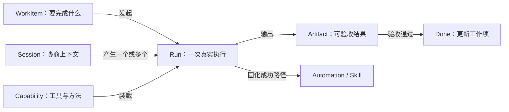

# AgentMate 功能规划 v2 —— 以任务交付为中心的 Local-first AI 工作系统

> 状态：产品设计基线 · 2026-07-21
>
> 范围：重新定义产品主线、功能边界、信息架构、优先级和阶段验收；不代表文中待建能力已经实现。
>
> 关联：[真实实现方案](agentmate-实现方案.md) · [Server 架构](agentmate-server-架构设计.md) ·
> [数据分层与同步规范](agentmate-数据分层与同步规范.md) · [Console 设计](agentmate-console-管理门户设计.md) ·
> [WorkBuddy 产品对标](WorkBuddy/product-design-analysis.md)

---

## 1. 重新规划的结论

AgentMate 下一阶段不再以“增加一个页面、一个目录卡片或一个项目管理视图”为功能完成标准，
而以一条唯一主线组织全部产品能力：

> **用户提出目标 → Agent 制定可审阅计划 → 在明确权限内执行真实操作 → 产出可打开、可验证的结果 →
> 用户验收 → 将成功过程复用为自动化或组织能力。**

新的产品定义是：

> **AgentMate 是一个 local-first 的 AI 任务交付系统。App 负责私密执行，Server 负责团队控制与同步，
> Console 负责组织治理和能力发布。**

本轮重排做出六个取舍：

1. **任务交付优先于聊天体验**：聊天是输入与协商界面，不是产品主对象。
2. **真实产物优先于能力数量**：先补文件、浏览器和办公文档闭环，再扩更多橱窗卡片。
3. **项目服务于执行协作**：不继续把 AgentMate 扩成另一套通用项目管理软件。
4. **助理服务于持续入口**：助理是常驻配置和渠道入口，不与项目、任务、专家概念互相替代。
5. **能力发布必须可治理**：Skill、工具、权限、兼容版本和撤回策略是一个原子发布问题。
6. **多 Agent 延后**：在单 Agent 的交付成功率、权限、安全、成本和评测体系稳定前，不把多人格组合包装为专家团。

---

## 2. 当前能力基线与主要矛盾

### 2.1 已形成的真实底座

- 本地 FastAPI agent 工具循环、SSE 事件、SQLite 持久化、项目沙箱、Ask/Plan/执行模式；
- 会话、项目、工作项、自动化、文件与产物入口；
- 专家、Skill、连接器、知识库、模型管理及会话级 loadout；
- 多助理与 Telegram/邮件渠道；
- 账号、组织、项目成员、角色、邀请、评论、通知和团队时间线；
- AgentMate Server 控制平面、Server 下行/本地 outbox 上行和离线回退；
- AgentMate Console 目录与项目管理能力；
- Tauri 桌面外壳、sidecar 和 updater 脚手架。

这些能力说明系统已经越过“聊天原型”阶段。新版规划不是推倒重来，而是收敛对象、入口和验收口径。

### 2.2 当前最需要解决的产品矛盾

| 矛盾 | 当前表现 | 新规划中的处理 |
|---|---|---|
| 功能多，主线弱 | 首页、项目、助理、自动化、专家、技能、连接器等入口并列 | 全部围绕“发起、执行、交付、复用”四阶段重组 |
| 会话、任务、工作项概念混用 | sidebar 会话被称为任务，项目里又有 work item | 明确 Session、Run、WorkItem 三种对象及关系 |
| 展示能力强于交付能力 | 有写作/分析类卡片，但缺 DOCX/XLSX/PPTX/PDF、浏览器等专用工具 | P0 优先补真实工具和渲染验收链路 |
| 项目管理持续横向扩张 | App 与 Console 均有看板、列表、甘特、负载等 | 保留协作所需最小 PM；新增投入优先连接工作项与 Agent 执行 |
| 能力目录与运行版本脱节 | 目录定义、已安装 Skill、工具绑定、App 二进制可能是不同版本 | 建立原子能力包、兼容门禁、灰度、撤回和回滚 |
| 无人值守缺少完整信任模型 | 自动化能运行，但确认、恢复、结果投递和审计仍不统一 | 建立风险分级、检查点、审批、幂等、重试和通知标准 |

---

## 3. 产品角色与核心任务

### 3.1 个人执行者

希望用一句自然语言完成研究、整理、写作、数据处理、网页操作或文件交付；关心结果是否正确、文件在哪里、
系统改了什么，以及失败后能否继续。

### 3.2 项目成员与负责人

希望把团队工作项交给 Agent 执行，看到计划、进度、产物、风险和验收结果；需要评论、交接和审计，
但不需要 AgentMate 取代完整的专业研发或项目管理平台。

### 3.3 助理运营者

希望配置一个常驻助理，通过 App、Telegram、邮件等入口持续处理请求；关心渠道身份、权限范围、
工作空间、失败告警和响应质量。

### 3.4 组织管理员与能力发布者

希望管理成员、项目、目录和客户端兼容性，把验证过的 Skill/连接器/专家配置发布给组织，
并能灰度、撤回、回滚和审计。

---

## 4. 统一产品对象模型

新版功能设计以六个一级对象为准，避免继续用页面名称代替领域模型。

| 对象 | 定义 | 权威位置 | 不是 |
|---|---|---|---|
| **WorkItem** | 团队或个人要完成的工作，含负责人、优先级、状态和验收条件 | Server 项目协作数据；纯本地时本地权威 | 不是一段聊天记录 |
| **Run** | Agent 对一个目标的一次真实执行，含计划、权限、事件、成本、状态和结果 | 本地执行平面 | 不是长期对话上下文本身 |
| **Session** | 用户与 Agent 持续协商的上下文，可发起多个 Run | 本地 | 不是项目任务状态 |
| **Artifact** | Run 的可交付结果，含文件、预览、来源、校验和验收状态 | 本地工作区；Server 只同步允许的元数据 | 不是埋在消息里的普通附件 |
| **Capability** | Tool、Skill、Connector、Agent Profile 等可版本化能力 | Server 目录定义 + 本机安装快照/实现 | 不是只有文案的橱窗卡 |
| **Automation** | 触发条件 + 固定执行配置 + 权限策略 + 结果投递 | 本地执行，本地记录；可同步元数据 | 不是只有定时表达式的任务 |

关键关系如下：

实现时允许先在现有 `sessions`、消息 trace、work items 和文件数据上派生 Run/Artifact 视图，
不要求第一阶段立刻大迁移数据库；但新增 API、UI 文案和事件必须遵循该语义。

---

## 5. 三个产品面的职责

### 5.1 AgentMate App：私密执行与个人工作台

负责：

- 目标输入、计划确认、执行、暂停、恢复和验收；
- 本机模型调用、文件/浏览器/办公工具、沙箱和连接器凭据；
- Session、Run、完整 trace、正文与 Artifact；
- 项目执行工作台、助理、自动化、知识库和本机安装能力；
- Server 离线时的最后可用快照与 local-first 回退。

不负责：组织级目录发布审批、全局成员治理、客户端灰度策略。

### 5.2 AgentMate Server：控制平面与协作权威

负责：

- 账号、组织、项目、成员、角色、邀请和协作对象；
- 目录、能力版本、推荐、兼容策略、撤回状态和发布 revision；
- 允许上云的运行元数据、团队时间线、通知和同步游标；
- 客户端 capability report、最低版本门禁和审计 API。

不保存：LLM Key、连接器 secret、默认完整会话正文、沙箱文件和任意本机可执行代码。

### 5.3 AgentMate Console：治理与发布操作台

负责：

- 组织、用户、项目与角色治理；
- 能力草稿、Test Run、审核、发布、灰度、撤回和回滚；
- 客户端版本/能力兼容分布、同步健康和审计；
- 项目级只读运营概览及必要的管理操作。

Console 不再与 App 竞争“日常执行工作台”。项目成员的目标输入、Agent 执行、文件查看和验收主要发生在 App。

---

## 6. App 信息架构重组

### 6.1 一级导航

建议从“模块平铺”改为四组，保留既有深链接并渐进迁移：

| 分组 | 一级入口 | 承载内容 |
|---|---|---|
| **开始工作** | 首页 | 一句话发起任务、最近 Run、待验收结果、失败恢复、推荐场景 |
| **工作** | 项目、助理、自动化 | 有边界的项目执行、常驻入口、无人值守执行 |
| **资源** | 产物与文件、知识库 | 跨 Run 的交付物、工作空间文件、知识资料 |
| **能力** | 技能、连接器、Agent 配置 | 发现、安装、授权、版本、权限与试运行 |

调整原则：

- “灵感”降为首页的推荐场景和任务模板，不占独立主导航；
- “我的文件”升级为“产物与文件”，默认先展示最近交付物，再进入工作空间树；
- “专家”逐步改成更准确的“Agent 配置/角色”；真实多 Agent 落地前不强化“专家团”承诺；
- 模型、账号、数据、安全、Server 连接继续归入统一设置中心；
- 首页不再只是新聊天页，而是任务控制台。

### 6.2 任务执行页

任务执行页固定为三个区域：

1. **目标与协商区**：目标、引用、Plan/Ask/执行模式、模型、工作区和能力装载；
2. **执行记录区**：计划、步骤、工具调用、确认、错误、重试、成本与人工输入；
3. **交付区**：Artifact、预览、变更、校验、验收、下载和“转为自动化/Skill”。

聊天消息不再承担展示全部执行状态和文件的职责。移动或窄屏下三个区域可以切换，但语义不变。

### 6.3 项目工作台

保留：概览、工作项、Agent Run、产物、讨论、成员和必要的里程碑/看板/列表视图。

收敛：

- 甘特、负载、WIP、模板、自定义字段、依赖关键路径、Sprint/燃尽与 PM 导出维持可用；该组通用 PM 尾项完成后不再继续横向扩张；
- 新增投入聚焦“工作项 → 指派给 Agent → 生成 Run → 产物验收 → 自动更新工作项”；
- 每个工作项必须能看到关联 Run、当前步骤、失败原因、Artifact 和验收人；
- Viewer/Member/Admin 的读写权限同时约束项目数据与 Agent 外部写操作。

---

## 7. 功能域重新排序

### 7.1 P0：任务交付内核

- 明确 Run 生命周期：draft / planning / waiting_approval / running / paused / failed / completed / accepted；
- Artifact manifest：类型、路径、来源 Run、生成工具、校验结果、预览、哈希和验收状态；
- 统一暂停、恢复、重试、取消和从检查点继续；
- 任务级验收条件和完成总结；
- token、耗时、工具调用与失败原因结构化记录。

### 7.2 P0：真实办公与浏览器工具

按“生成 → 渲染 → 检查 → 修正 → 交付”实现，而不是只提供写作提示：

- 文件：搜索、补丁编辑、复制、移动、重命名、归档和安全删除；
- 浏览器：导航、读取、交互、上传/下载、截图和登录态复用；
- DOCX：创建、编辑、批注/修订、渲染检查；
- XLSX：读取、公式、统计、图表、格式和重算验证；
- PPTX：创建、布局、渲染和逐页视觉检查；
- PDF：提取、生成、合并/拆分、表格/图片处理和页面渲染；
- OCR、图片生成/编辑和音频转写作为其后的多模态扩展。

### 7.3 P0：权限与无人值守安全

每个 Tool/Connector 声明结构化权限：

- `filesystem.read` / `filesystem.write`；
- `process.execute`；
- `network.read` / `network.write`；
- `external.read` / `external.write`；
- secret 使用范围、允许域名、工作区和最长运行时间。

策略分为：始终允许、每次确认、本 Run 允许、自动化预授权、禁止。新增写入/网络/外部服务能力时必须重新确认，
纯文本且不扩大权限的更新才可自动接受。

### 7.4 P0：能力发布闭环

一个 Skill 版本必须原子包含：

- 不可变 identity/slug、版本号和内容哈希；
- 指令、附加文件、工具绑定和权限清单；
- 最低/最高 App 版本、平台与依赖；
- 发布说明、迁移说明和回滚目标；
- 发布者、审核者、时间和审计记录。

发布流程固定为：`draft → test run → review → staged → published → revoked/rolled_back`。
Server 停用必须下发 tombstone，不能让同 slug 的 builtin 静默复活。

### 7.5 P1：可靠自动化与结果投递

- 触发：定时、手动、Webhook/渠道事件、项目工作项变化；
- 执行：幂等键、并发策略、超时、重试、检查点和失败队列；
- 权限：无人值守专用预授权，超出范围转人工审批；
- 投递：App 通知、邮件、Telegram、项目时间线和 Artifact 链接；
- 运维：运行历史、失败原因、重跑、禁用、审计和成本上限。

### 7.6 P1：项目协作闭环

- WorkItem 与 Run 一对多关联；
- Agent 可在授权范围内更新进度、阻塞原因和验收结果；
- 评论、@提及、通知、活动流围绕 WorkItem/Run/Artifact 三类对象组织；
- Server 只同步允许的摘要和产物元数据，正文/文件仍按 local-first 策略处理；
- 离线编辑、增量合并、身份映射和 outbox 健康必须可观察。

### 7.7 P1：能力发现与连接

- 首页场景模板只推荐当前设备可真实执行的组合；
- Skill 详情展示版本、工具、权限、兼容性、安装来源和最近 Test Run；
- Connector 统一 OAuth/API key/本机服务三类授权 UX；
- 优先补邮箱、日历、企业文档、主流 IM 和浏览器登录态；
- Knowledge 作为可挂载上下文资源，不单独制造另一套任务入口。

### 7.8 P2：真实多 Agent

只有同时具备以下能力后才发布“专家团”：

- 团长把目标拆成有依赖关系的子任务 DAG；
- 成员拥有独立上下文、工具权限、预算和 Run；
- 可并行执行、失败降级、取消和重试；
- 结果交叉审阅、冲突处理和最终汇总；
- 用户能看到每个成员的真实事件、成本和 Artifact；
- 评测证明多 Agent 相比单 Agent 在目标场景中有稳定收益。

---

## 8. 分阶段路线图

| 阶段 | 目标 | 主要交付 | 阶段退出条件 |
|---|---|---|---|
| **R0 收口** | 先稳定现状和统一口径 | 收口现有 P1/P2 未完成项；统一对象命名；完成 Console React 迁移首段与能力发布设计；建立基线评测 | 文档、UI、API 对 Session/Run/WorkItem/Artifact 口径一致；现有回归全过 |
| **R1 可交付** | 从“能对话执行”升级到“能交付办公成果” | Run/Artifact 模型；文件与浏览器工具；DOCX/XLSX/PPTX/PDF 首批闭环；渲染验收 | 选定的 10 个黄金任务可端到端生成并打开正确产物，失败可恢复 |
| **R2 可托管** | 让自动化和助理安全长期运行 | 结构化权限、审批检查点、幂等/重试、结果投递、审计、成本上限 | 连续运行基准中无重复外部写入；失败能告警、重跑和追溯 |
| **R3 可协作** | 把团队工作项与本地 Agent 执行闭环 | WorkItem↔Run↔Artifact；项目策略；协作通知；同步健康 | 团队成员可从工作项发起、跟踪、验收一次本地执行且权限正确 |
| **R4 可运营** | 让组织安全发布和升级能力 | 原子 Skill 版本、capability report、兼容门禁、灰度、tombstone、回滚、正式桌面更新服务 | 可完成一次灰度发布、权限变更确认、紧急撤回和客户端回滚演练 |
| **R5 可编排** | 在有评测证据后引入多 Agent | DAG 调度、独立 Run、并行、审稿、预算和评测 | 至少两个目标场景显著优于单 Agent，且成本/失败边界清楚 |

截至 2026-07-22：R0～R5 的产品与代码退出条件均已满足。R1 已具备办公产物工具与 10 个黄金任务
身份门禁，R5 已具备独立 Run 的多专家 DAG、审稿/预算/失败边界，并通过两个真实模型对照场景。
R4 的 Skill 不可变版本、capability、灰度、tombstone、回滚以及桌面更新代码链路已经落地；WB-257
已完成一次性真实 updater 密钥下的前后版本签名安装、错误签名拒绝与显式回滚演练。正式生产上线仍需部署方
提供 HTTPS 域名、CI updater 私钥和可信 Windows 代码签名证书，这属于部署条件而非功能代码缺口，由
WB-283 独立追踪，不阻塞 WB-239 路线图 epic 关闭。

### 8.1 排期规则

- R0 未退出前，不新建大规模展示型模块；
- R1 的办公工具按黄金任务倒推，不按文件格式数量平均铺开；
- R2 与 R3 可在数据契约稳定后交叉推进，但无人值守外部写必须先通过 R2 权限门；
- R4 的目录内容更新、Skill 快照升级、工具契约升级和 App 二进制升级必须分别测试；
- R5 不绑定发布日期，以评测结果作为准入条件。

---

## 9. 黄金任务与验收标准

首批黄金任务建议覆盖：

1. 读取一组资料，生成带目录和引用的 DOCX 报告；
2. 读取 CSV/XLSX，清洗数据、生成公式和图表并解释异常；
3. 根据品牌模板生成 PPTX，渲染后自动发现并修复溢出；
4. 合并/拆分 PDF，提取表格并生成核对结果；
5. 在登录态网页中检索、填写但在提交前请求确认；
6. 对工作区做跨文件修改，展示补丁并生成可复核总结；
7. 从项目 WorkItem 发起执行，回写进度并附上 Artifact；
8. 把成功 Run 保存为自动化，下一次幂等运行并通过指定渠道投递；
9. 安装一个扩大外部写权限的新 Skill 版本，触发权限 diff 和人工确认；
10. Server 撤回一个能力，离线 App 保持可解释状态，恢复网络后正确停止使用。

每项必须同时验证：

- 入口可发现且边界描述真实；
- 使用的是真实工具和真实数据；
- 权限范围、确认点和 secret 处理正确；
- trace 能解释发生了什么；
- Artifact 能打开、预览、下载和校验；
- 失败能停止、恢复或重试；
- 明暗主题与窄屏可用；
- 自动化测试与真机端到端验收均有证据。

---

## 10. 产品指标

不以页面数、目录条目数或消息数衡量进展。核心指标改为：

| 维度 | 指标 |
|---|---|
| 首次价值 | 首次可验收 Artifact 用时、首次任务成功率 |
| 交付质量 | 黄金任务完成率、Artifact 自动校验通过率、人工返工次数 |
| 执行可靠性 | Run 成功率、恢复成功率、重复外部写入次数、P95 执行时长 |
| 自动化 | 按期运行率、无人值守成功率、失败通知到达率、人工接管率 |
| 能力运营 | 安装成功率、兼容拦截准确率、撤回生效时延、回滚成功率 |
| 协作 | WorkItem 到 Run 转化率、验收时长、阻塞可见率 |
| 安全 | secret 泄漏为零、越权写入为零、审计完整率、权限扩大确认率 |
| 成本 | 每成功任务 token/时间成本、多 Agent 相对单 Agent 的收益比 |

---

## 11. 明确不做或暂缓

- 不以复刻竞品全部页面和卡片为目标；
- 不把 AgentMate Console 建成成员日常工作的第二套 App；
- 已交付的依赖、自定义字段、Sprint/燃尽和导出只维持可靠性，不继续扩张资源财务、复杂容量规划等 PM 深水功能；
- 不允许 Server 下发未签名的 Python、PowerShell 或任意可执行代码；
- 不默认上传完整会话、工作区文件、LLM Key 或连接器 secret；
- 不用 `run_command` 冒充所有专用办公工具；
- 不把提示词组合、静态头像或多个 persona 同时注入称为真实多 Agent；
- 不以 updater 脚手架、目录 CRUD 或展示卡片宣称生产发布能力已完成。

---

## 12. 从现状迁移到新版规划

1. **先不做破坏性重命名**：保留现有路由和数据表，通过 UI 文案、聚合视图和 API DTO 先统一语义。
2. **Run 先派生后独立**：第一步从 session 内的一次执行区间派生 Run；生命周期稳定后再决定是否独立建表。
3. **Artifact 先建立 manifest**：继续使用现有沙箱文件，把产物元数据和验收状态独立出来。
4. **首页先聚合**：不删除现有项目、助理、自动化页面，先把待执行、运行中、待验收、最近产物聚到首页。
5. **项目页只做连接**：先完成 WorkItem↔Run↔Artifact，再评估是否还需要新增 PM 视图。
6. **能力目录先加真实性门禁**：不兼容、未安装、未授权、已撤回和仅展示状态必须明确区分。
7. **Console 渐进迁移**：新 React/Ant Design Console 按路由替换旧单文件页面，API 契约保持稳定。
8. **所有新增实现先登记 issue**：按 R0–R5 拆 epic 和可独立验收的子 issue；一项交付对应一组同源变更和验证证据。

---

## 13. 交付后的持续运营

路线图实现已完成，后续不再按旧“待实施”清单重复登记。持续运营按以下规则执行：

1. 保持 10 个黄金任务、Run/Artifact、自动化幂等、协作权限和多 Agent 对照评测为发布门禁；
2. 新需求先证明对任务成功率、交付质量或运营可靠性有可测收益，再登记独立 issue；
3. Skill/工具目录、权限、兼容、撤回和客户端版本继续使用数据库权威源与审计链，不回退到文件管理；
4. 正式桌面更新生产上线只在 WB-283 的外部域名、CI 密钥、可信证书齐备后执行，不使用演练材料冒充生产；
5. 每次阶段性回归同时核对 App、Local Agent、Server、Console 和桌面安装边界，保留脱敏验证证据。
